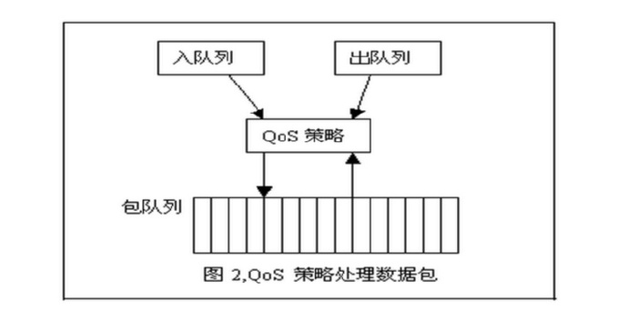
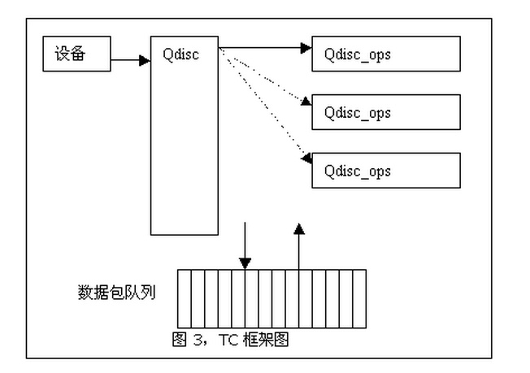
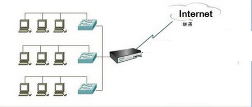

linux下QOS：应用篇
=================

接[上一篇](./qos-theory.md)。

Linux采用了基于对象的实现方法，qos还能保证对不同接口采用不同的策略，TC QOS有很多拥塞控制的机制默认的是FIFo还有其他PQ、CQ、WFQ等.



策略类用结构体：Qdisc_ops表示。每个设备可以采用不同的策略对象，在设备和对象的关联需要到Qdisc结构体。



通过上面的描述，整个TC的架构也就出来了，发送数据包的流程应该是这样的：

    （1） 上层协议开始发送数据包
    （2） 获得当前设备所采用的策略对象
    （3） 调用此对象的enqueue方法把数据包压入队列
    （4） 调用此对象的dequeue方法从队列中取出数据包
    （5） 调用网卡驱动的发送函数发送

并且在上一节我们已经讲了tc的三级树型组织.这里不再贴图. 还有一点注意的就是tc控发不空收.

### 命令格式
```
# tc qdisc [ add | change | replace | link ] dev DEV [ parent qdisc-id | root ] [ handle qdisc-id ] qdisc [ qdisc specific parameters ]

# tc class [ add | change | replace ] dev DEV parent qdisc-id [ classid class-id ] qdisc [ qdisc specific parameters ]

# tc filter [ add | change | replace ] dev DEV [ parent qdisc-id | root ] protocol protocol prio priority filtertype [ filtertype specific parameters ] flowid flow-id

# tc [-s | -d ] qdisc show [ dev DEV ]

# tc [-s | -d ] class show dev DEV tc filter show dev DEV
```

### 具体的配置流程如下
Linux流量控制主要分为**`建立队列`**、**`建立分类`**和**`建立过滤器`**三个方面。

#### 基本实现步骤

    （1） 针对网络物理设备（如以太网卡eth0）绑定一个队列QDisc；
    （2） 在该队列上建立分类class；
    （3） 为每一分类建立一个基于路由的过滤器filter；
    （4） 最后与过滤器相配合，建立特定的路由表等

### tc 命令的基本用法
查看 `tc help` 或者 `man tc`。

不同的策略算法，有不同的参数配置。

### 无分类qdisc 和 分类qdisc

#### 无分类

##### [p|b]fifo
使用最简单的qdisc，纯粹的先进先出。只有一个参数：limit，用来设置队列的长度,pfifo是以数据包的个数为单位；bfifo是以字节数为单位。

##### pfifo_fast
在 编译内核时，如果打开了高级路由器(AdvancedRouter)编译选项，pfifo_fast就是系统的标准QDISC。它的队列包括三个波段(band)。在每个波段里面，使用先进先出规则。而三个波段(band)的优先级也不相同，band 0的优先级最高，band 2的最低。如果band里面有数据包，系统就不会处理band1里面的数据包，band 1和band 2之间也是一样。数据包是按照服务类型(Type ofService,TOS)被分配多三个波段(band)里面的

##### red
red是Random Early Detection(随机早期探测)的简写。如果使用这种QDISC，当带宽的占用接近于规定的带宽时，系统会随机地丢弃一些数据包。它非常适合高带宽应用。

##### sfq
sfq是Stochastic Fairness Queueing的简写。它按照会话(session–对应于每个TCP连接或者UDP流)为流量进行排序，然后循环发送每个会话的数据包

##### tbf
tbf是Token Bucket Filter的简写，适合于把流速降低到某个值 。

如果没有可分类QDisc，不可分类QDisc只能附属于设备的根。它们的用法如下：
```
# tc qdisc add dev DEV root QDISC QDISC-PARAMETERS
```
要删除一个不可分类QDisc，需要使用如下命令：
```
# tc qdisc del dev DEV root
```

一个网络接口上如果没有设置QDisc，pfifo_fast就作为缺省的QDisc。

#### 分类

##### CBQ
CBQ 是Class Based Queueing(基于类别排队)的缩写。它实现了一个丰富的连接共享类别结构，既有限制(shaping)带宽的能力，也具有带宽优先级管理的能力。带宽限制是通过计算连接的空闲时间完成的。空闲时间的计算标准是数据包离队事件的频率和下层连接(数据链路层)的带宽.

##### HTB
HTB 是 Hierarchy Token Bucket的缩写。通过在实践基础上的改进，它实现了一个丰富的连接共享类别体系。使用HTB可以很容易地保证每个类别的带宽，虽然它也允许特定的类可以突破带宽上限，占用别的类的带宽。HTB可以通过TBF(Token Bucket Filter)实现带宽限制，也能够划分类别的优先级。

##### PRIO
PRIO QDisc不能限制带宽，因为属于不同类别的数据包是顺序离队的。使用PRIO QDisc可以很容易对流量进行优先级管理，只有属于高优先级类别的数据包全部发送完毕，才会发送属于低优先级类别的数据包。

为了方便管理，需要使用iptables或者ipchains处理数据包的服务类型(Type Of Service,ToS)

### class的操作原理

类(Class)组成一个树，每个类都只有一个父类，而一个类可以有多个子类。

某些QDisc(例如：CBQ和HTB)允许在运行时动态添加类，而其它的QDisc(例如：PRIO)不允许动态建立类。允许动态添加类的QDisc可以有零个或者多个子类，由它们为数据包排队。

此外，每个类都有一个叶子QDisc，默认情况下，这个叶子QDisc使用pfifo的方式排队，我们也可以使用其它类型的QDisc代替这个默认的QDisc，而且，这个叶子QDisc可以有分类，不过每个分类只能有一个叶子QDisc。

当一个数据包进入一个分类QDisc，它会被归入某个子类。我们可以使用以下三种方式为数据包归类，不过不是所有的QDisc都能够使用这三种方式。

#### 其他

显示队列情况
```
# tc qdisc ls dev eth0
```

显示分类状况
```
# tc class ls dev eth0  # 更详细的可以加 –s参数
```

显示过滤器的状况
```
# tc –s filter ls dev eth0
```

显示路由的情况
```
# ip route
```

#### Qdisc的参数
##### parent major:minor 或者 root
一个qdisc是根节点就是root，否则其他的情况指定parent。其中major:minor是class的handle id，每个class都要指定一个id用于标识。

##### handle major
这个语法有点奇怪，是可选的，如果qdisc下面还要分类（多个class)，则需要指定这个hanlde。对于root，通常是”1:”。

**注意：**对于tc命令中的qdiscs和classes，标识handle(classid)的语法都是x:y，其中x是一个整数用来标识一个 qdisc，y是一个整数，用来标识属于该qdisc的class。qdisc的handle的y值必须是0，class的handle的y值必须是非 0。通常”1:0″简写为”1:”，也就是上面看到的写法。

##### default minor-id
未分类（不能和filter匹配）的流量（默认的）会被送到这个minor所指定的类（class id为major:minor-id）。

#### Class的参数
```
tc class [ add | change | replace ] dev dev parent major:[minor] [ classid major:minor ] htb rate rate [ ceil rate ] burst bytes [ cburst bytes ] [ prio priority ]
```

##### parent major:minor
指定这个类的父节点，父节点可以是Qdisc，也可以是Class，如果是Qdisc，那么就不用指定minor，这个是必须的参数。

##### classid major:minor
classid作为class的标识，这个是可选的。如果这个class没有子节点，就可以不指定。major是父qdisc的handle。

##### rate
是一个类保证得到的带宽值.如果有不只一个类,请保证所有子类总和是小于或等于父类.

##### prio
用来指示借用带宽时的竞争力,prio越小,优先级越高,竞争力越强. 低优先级的class会优先匹配

##### ceil
ceil是一个类最大能得到的带宽值。即可以借用的带宽（默认ceil=rate），根类是不允许被借用的. 这个借用在什么时候生效呢？如果父类有空余带宽，最高可以分配给当前class的值，默认是和rate一样。

##### Burst
突发，突发的流量，即大于限制带宽的时候（> rate，< ceil）；允许以ceil的速率发送的字节数，应该至少和子类的burst最大值一样。

##### cburst
允许以网口的最高速率发送的字节数，应该至少和子类的cburst最大值一样。功能类似tbf中的peakrate，当这个值限制很小时，可以避免突发的流量，以避免瞬间速率超过ceil。

##### quantum
每轮当前的class能发送的字节数，默认的计算quantum = rate / r2q. Quantum必须大于1500 小于 60000。

quantum 只在class的流量超过了rate但是没超过ceil时使用。quantum越小，带宽共享的效果就越好。 r2q 用来计算quantum,r2q默认是10。

我们先看一个实际class的分类图：


### 几个应用例子

#### 1. 多用户ip带宽平均分配问题
实际应用场景为小区里，共享一根带宽上网问题。假如实际带宽为20m ；用户数量为100，都在一个vlan里；限制用户下载带宽200kbps。

先看实际环境的布局：


我们把小区的部分放大：



```
# tc qdisc del dev eth0 root
# tc qdisc add dev eth0 root handle 1: htb r2q 1
# tc class add dev eth0 parent 1: classid 1:1 htb rate 20mbit ceil 100mbit
# tc class add dev eth0 parent 1:1 classid 1:10 htb rate 200kbit ceil 250kbit
# tc filter add dev eth0 parent 1: protocol ip prio 16 u32 match ip dst 192.168.1.0/24 flowid 1:10
```
关于filter匹配策略，也可以用iptables的MARK，在tc里为fw，用法如下：
```
# tc filter add dev eth0 parent 1: protocol ip prio 10 handle 1 fw classid 10:10
# iptables -t mangle -A POSTROUTING -d 192.168.1.0/24 -j MARK --set-mark 1
```

有时候对于子分类里资源有可能被某一个会话一直占有而其他得不到分配，所以需要添加子队列来实现资源公平分配：
```
# tc qdisc add dev eth1 parent 1:10 handle 101: sfq perturb 10
```

假如有两个子网呢？平均分配这20M带宽：
```
# tc qdisc add dev eth0 root handle 1: htb r2q 1
# tc class add dev eth0 parent 1: classid 1:1 htb rate 20mbit ceil 100mbit

# tc class add dev eth0 parent 1:1 classid 1:10 htb rate 10mbit ceil 20mbit
# tc class add dev eth0 parent 1:1 classid 1:20 htb rate 10mbit ceil 20mbit

# tc qdisc add dev eth0 parent 1:10 handle 10: sfq perturb 10
# tc qdisc add dev eth0 parent 1:20 handle 20: sfq perturb 10

# tc filter add dev eth0 protocol ip parent 1: prio 10 u32 match ip dst 192.168.1.0/24 flowid 1:10
# tc filter add dev eth0 protocol ip parent 1: prio 20 u32 match ip dst 192.168.2.0/24 flowid 1:20
```

#### 2. 单独限制某一个应用的速率问题
这个问题主要在于filter上，是匹配端口还是什么，可以通过iptables来实现.这里不详细列举配置了.

#### 3.多应用优先级问题 （voip 视频 vpn、其他）

同样我们还使用 htb 算法
```
# tc qdisc add dev eth0 root handle 1: htb
# tc class add dev eth0 parent 1: classid 1:1 htb rate 100mbit ceil 100mbit prio 0
# tc class add dev eth0 parent 1:1 classid 1:10 htb rate 100mbit ceil 100mbit prio 1
# tc class add dev eth0 parent 1:1 classid 1:11 htb rate 100mbit ceil 100mbit prio 2
# tc class add dev eth0 parent 1:1 classid 1:12 htb rate 50mbit ceil 50mbit prio 3
# tc class add dev eth0 parent 1:1 classid 1:13 htb rate 50mbit ceil 50mbit prio 4

# tc qdisc add dev eth0 parent 1:10 handle 10: sfq perturb 10
# tc qdisc add dev eth0 parent 1:11 handle 11: sfq perturb 10
# tc qdisc add dev eth0 parent 1:12 handle 12: sfq perturb 10
# tc qdisc add dev eth0 parent 1:13 handle 13: sfq perturb 10

# tc filter add dev eth0 prarent 1:0 protocol ip prio 1 handle 1 fw classid 1:10
# tc filter add dev eth0 prarent 1:0 protocol ip prio 2 handle 2 fw classid 1:11
# tc filter add dev eth0 prarent 1:0 protocol ip prio 3 handle 3 fw classid 1:12
# tc filter add dev eth0 prarent 1:0 protocol ip prio 4 handle 4 fw classid 1:13

Set-mark:
1. voip
2. vpn
3. 视频
4. 其他
```
上面我们简单介绍了实际应用的三个例子。至少我们明白了tc应用的基本流程和简单配置，更复杂的用法需要自己去深入学习.

我们需要注意的是上传与下载虽然相对独立，但是他们也会相互影响，比如tcp的性能问题，每传输一个报文同时都需要得到一个响应报文.还有关于报文大小的问题，也需要注意，有时候配置tc的时候，需要我们把mtu的值调大，不然就会造成丢包.例:
```
# tc qdisc add dev eth0 handle 2 root tbf burst 200kb rate 200kbps mtu 8000 latency 10
```

在我们具体配置队列的时候，会被一大堆参数绕晕，其实我们只需要针对具体的策略算法，查看帮助即可，本身命令的帮助已经很清晰，然后我们再针对具体算法查询资料即可。

这里讲的也仅仅是linux系统自带的功能，对于更复杂的则需要我们自己去实现一些特殊的功能，比如cos和dscp等.

From: http://blog.chinaunix.net/uid-20786208-id-5182227.html
