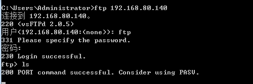
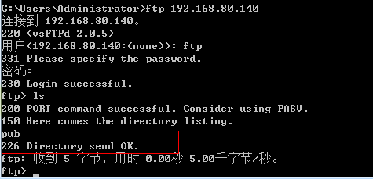
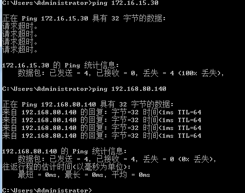
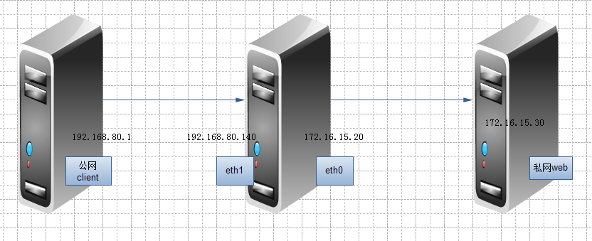
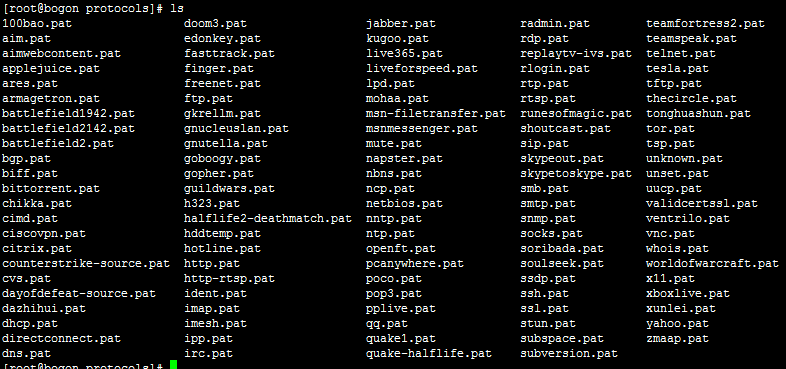

### 1、匹配扩展

在匹配扩展中，还有需要加 -m 引用模块的显示扩展，默认是隐含扩展，不要使用 -m

##### 状态检测的包过滤

    -m state
        --state {NEW,ESTATBLISHED,INVALID,RELATED}  指定检测那种状态

    -m multiport 指定多端口号
        --sport
        --dport
        --ports

    -m iprange 指定IP段
        --src-range ip-ip
        --dst-range ip-ip

    -m connlimit 连接限定
        --comlimit-above # 限定最大连接个数

    -m limit 现在连接速率，也就是限定匹配数据包的个数
        --limit  指定速率
        --limit-burst # 峰值速率，最大限定

    -m string 按字符串限定
        --algo bm|kmp  指定算法bm或kmp
        --string "STRING" 指定字符串本身

##### Examples

```
# iptables -A INPUT -s 0.0.0.0/0.0.0.0 -d 192.168.80.139 -p tcp --dport 22 -m state --state NEW,ESTABLISHED -j ACCEPT
```
允许任何主机状态为NEW，ESTABLISHED的状态连接，这里要注意当写成0.0.0.0/0.0.0.0 表示任意地址的时候是可以省略的，如下即可：
```
# iptables -A INPUT -d 192.168.80.140 -p tcp --dport 22 -m state --state NEW,ESTABLISHED -j ACCEPT
```

允许本机的ESTABLISHED状态出去，为了防止有反弹时木马，让服务器主动向外发起请求
```
# iptables -A OUTPUT -s 192.168.80.140 -p tcp --sport 22 -m state --state ESTABLISHED -j ACCEPT
```
之后再修改默认权限为拒绝即可
```
# iptables -P INPUT  DROP
# iptables -P OUTPUT DROP
```

现在在本机ping 127.0.0.1, 发现时不同的，所以要允许本机，下面在写一个：
```
# iptables -I INPUT  1 -s 127.0.0.1 -d 127.0.0.1 -j ACCEPT
# iptables -I OUTPUT 1 -s 127.0.0.1 -d 127.0.0.1 -j ACCEPT
```

如果要限制80端口的话，那在就在写一条，现在写在一条里，为了节省查询时间。
之前的--sport或--dport后面可以添加连续的如 --sport 22:80 表示从22到80的所有端口，不符合现在的条件，所以我们用第二个显示扩展：
```
# iptables -A INPUT -d 192.168.80.140 -p tcp -m multiport --dport 22,80 -m state --state NEW,ESTABLISHED -j ACCEPT
```
这样就把22与80合在一起了，OUTPUT同理，但要注意源端口目标端口，之后再删除原来的即可。
（注意：有SSH的话一定要先添加在删除）

这里需要知道一点，从本机出去的ESTABLISHED都是现请求进来的，所以可以写成如下：
```
# iptables -A OUTPUT -m state --state ESTABLISHED -j ACCEPT
```
表示所有客户端NEW请求进来、服务器返回ESTABLISHED的状态全部允许

也可以添加在INPUT中，提高查询速度
```
# iptables -I INPUT 1 -m state --state ESTABLISHED -j ACCEPT　
```
这里的原理是，**当NEW请求的时候匹配他自己的那条规则，当建立连接后，直接就匹配这条规则，提高效率**。

例如：第一条是允许ESTABISHED的，第二条是22的NEW、ESTABLISHED的规则，这样当用户请求22的时候先匹配22的NEW，之后的ESTABLISHED状态直接匹配第一条，不用在去匹配第二条的规则了，这样当我们有许多条目的时候大大提高了效率。

```
# iptables -A INPUT -d 192.168.80.140 -m iprange --src-range 192.168.80.130-192.168.80.150 -p tcp --dport 23 -m state --state NEW -j ACCEPT
```
指定 192.168.80.130-192.168.80.150 可以访问本机的23端口

```
# iptables -I INPUT 2 -d 192.168.80.140 -p tcp --dport 22 -m state --state NEW -m connlimit ! --connlimit-above 2 -j ACCEPT
```
这里 `connlimit ! --connlimit-above 2 -j ACCEPT` 表示只允许SSH本机2次，`connlimit --connlimit-above 2 -j DROP` 表示超过2次后拒绝，这里因为默认权限是拒绝的所以用 `!` 取反，而且前面有写允许22端口的，这里不匹配后就会先下匹配那条，将匹配22允许的更改即可。

```
# iptables -A INPUT -d 192.168.80.140 -p tcp --dport 80 -m state --state NEW -m limit --limit 1/second --limit-burst 3 -j ACCEPT
```
表示对web服务的新连接请求，平均每秒只允许1个，最多一次进3个

```
# iptables -I OUTPUT 1 -m string --algo kmp --string "peace" -j DROP
```
表示在本机响应当中，包含“peace”字符串的主机被拒绝

### 2、如何开放FTP

##### 主动模式开放FTP
```
# iptables -A INPUT  -d 192.168.80.140 -p tcp --dport 21 -m state --state NEW -j ACCEPT
# iptables -A INPUT  -d 192.168.80.140 -p tcp --dport 20 -m state --state NEW -j ACCEPT
# iptables -A INPUT  -m state --state ESTABLISHED,RELATED -j ACCEPT
# iptables -A OUTPUT -m state --state ESTABLISHED,RELATED -j ACCEPT
```

##### 被动模式开放FTP
(1)清空之前的配置，重启服务即可
```
# service iptables restart
```

(2)先添加ssh规则
```
# iptables -A INPUT  -m state --state ESTABLISHED -j ACCEPT
# iptables -A OUTPUT -m state --state ESTABLISHED -j ACCEPT
# iptables -A INPUT  -d 192.168.80.140 -p tcp --dport 22 -m state --state NEW -m connlimit ! --connlimit-above 3 -j ACCEPT
# iptables -P INPUT  DROP
# iptables -P OUTPUT DROP
```

(3)下面开启FTP
```
# iptables -A INPUT -d 192.168.80.140 -p tcp --dport 21 -m state --state NEW -j ACCEPT
```
但是访问还是不行。



(4)先加载模块
```
# modprobe ip_nat_ftp
# lsmod | grep ftp
ip_nat_ftp              7361  0
ip_nat                 20973  1 ip_nat_ftp
ip_conntrack_ftp       11569  1 ip_nat_ftp
ip_conntrack           53409  5 ip_nat_ftp,ip_nat,ip_conntrack_ftp,xt_connlimit,xt_state
```

(5)开放 RELATED 状态
```
# iptables -R INPUT  2 -m state --state ESTABLISHED,RELATED -j ACCEPT
# iptables -R OUTPUT 1 -m state --state ESTABLISHED,RELATED -j ACCEPT
```

(6)在连接下发现可以了



前面重启服务的话规则就没有了，所以当确定后了之后执行以下命令保存：
```
# service iptables save
或
# iptables-save > /etc/sysconfig/iptables
```

这里有两个文件要知道下：

    /etc/sysconfig/iptables: 保存规则的文件
    /etc/sysconfig/iptables-config：向iptables脚本提供配置文件的文件

### 3、SNAT于DNAT配置

#### SNAT
首先清空之前的配置，拓扑如下：


先ping下，是不通的。



(1)先开启路由功能
```
# vim /etc/sysctl.conf
net.ipv4.ip_forward = 1
# sysctl -p
```

(2)client 添加路由
```
# route add 172.16.0.0 mask 255.255.0.0 192.168.80.140

web添加路由
# route add -net 0.0.0.0 gw 172.16.15.20
```

访问发现是192.168.80.1访问的


(3)下面也可以添加个拒绝PING的
```
# iptables -A FORWARD -p icmp --icmp-type 8 -j REJECT

添加SNAT规则
# iptables -t nat -A POSTROUTING -s 192.168.80.0/24 -j SNAT --to-source 172.16.15.20
```

(4)访问172.16.15.30下web在看日志，发现已经是172.16.15.20


这里至指定的一个IP地址，如果是拨号的话这个地址是不固定的所以可以用如下方式：
```
# iptables -t nat -A POSTROUTING -s 192.168.80.0/24 -j MASQUERADE
```
不过这种方法比指定更消耗资源

另将web添加的路由删除，发现也是可以访问的。


#### DNAT的实现：
拓扑如下：



(1)先开启路由功能
```
# vim /etc/sysctl.conf
net.ipv4.ip_forward = 1
# sysctl -p
```

(2)这里的web就一定要指定网关了
```
# route add -net 0.0.0.0 gw 172.16.15.20
```

(3)添加规则，将请求192.168.80.140的web转换到172.16.15.30上
```
# iptables -t nat -A PREROUTING -d 192.168.80.140 -p tcp --dport 80 -j DNAT --to-destination 172.16.15.30
```

(4)访问192.168.80.140后看下日志，发现是192.168.80.1


(5)这里本地服务器没有log记录，要添加的话如下：
```
# iptables -t nat -I PREROUTING 1 -d 192.168.80.140 -p tcp --dport 80 -j LOG --log-prefix "DNAT for Web:"
```

(6)之后看下本地日志,tail /var/log/messages 发现本地已经有日志信息了


### 4、利用recent抵御DOS攻击
```
# iptables -I INPUT -p tcp --dport 22 -m connlimit -connlimit-above 3 -j DROP
# iptables -I INPUT -p tcp --dport 22 -m state --state NEW -m recent --set -name SSH
```
记录访问tcp 22端口的新连接，记录名称为`SSH`，`--set`记录数据包的来源IP，如果IP已经存在将更新已经存在的条目。

```
# iptables -I INPUT -p tcp --dport 22 -m state --state NEW -m recent --update --seconds 300 --hitcount 3 --name SSH -j DROP
```
表示SSH记录中的IP在300s内发起超过3次连接则拒绝此IP的连接。


### 5、做应用层的iptables，限制迅雷、QQ

注意这里的版本有要求的：

    iptables-1.4.3 以上
    kernel-2.6.20 以上

#### 试验步骤

(1)给内核打补丁，并重新编译内核
```
# tar zxvf linux-2.6.28.10.tar.gz -C /usr/src
# tar zxvf netfilter-layer7-v2.22.tar.gz -C /usr/src
# cd /usr/src
# ln –s linux-2.6.28.10 linux
# cd /usr/src/linux/
# patch -p1 < ../netfilter-layer7-v2.22/kernel-2.6.25-2.6.28-layer7-2.22.patch
# cp /boot/config-2.6.18-164.el5 /usr/src/linux/.config
# make menuconfig
```

编译选着如下内容：
```
Networking support → Networking Options →Network packet filtering framework →Core Netfilter Configuration
<M>  Netfilter connection tracking support
<M>  “layer7” match support
<M>  “string” match support
<M>  “time”  match support
<M>  “iprange”  match support
<M>  “connlimit”  match support
<M>  “state”  match support
<M>  “conntrack”  connection  match support
<M>  “mac”  address  match support
<M>   "multiport" Multiple port match support

Networking support → Networking Options →Network packet filtering framework → IP: Netfilter Configuration
<M> IPv4 connection tracking support (required for NAT)
<M>   Full NAT
<M>     MASQUERADE target support
<M>     NETMAP target support
<M>     REDIRECT target support
```

编译安装
```
# make
# make modules_install
# make install
```

(2)给iptables源码打补丁，并重新编译iptables
```
# cp /etc/init.d/iptables ~/iptables
# cp /etc/sysconfig/iptables-config ~/
# rpm -e iptables-ipv6 iptables iptstate --nodeps
# tar jxvf iptables-1.4.6.tar.bz2 –C /usr/src
# cd /usr/src/iptables-1.4.6
# cp ../netfilter-layer7-v2.22/iptables-1.4.3forward-for-kernel-2.6.20forward/libxt_layer7.* ./extensions/
# ./configure --prefix=/usr --with-ksource=/usr/src/linux
# make
# make install
```

(3)安装l7proto
```
# tar zxvf l7-protocols-2009-05-28.tar.gz
# cd l7-protocols-2009-05-28
# make install

这里的iptables文件要做修改的将/sbin/$IPTABLES改成/usr/sbin/$IPTABLISH
# mv ~/iptables /etc/rc.d/init.d/

# service iptables start

限制xunlei
#　iptables -A FORWARD -m layer7 --l7proto xunlei -j DROP
```
限制的相关信息都在这里 `/etc/l7-protocols/protocols/` 可以产考，像qq、pplive等都有的



PS:
本文出自 “毛竹之势” 博客，请务必保留此出处http://peaceweb.blog.51cto.com/3226037/924184
