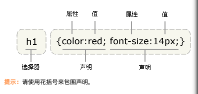
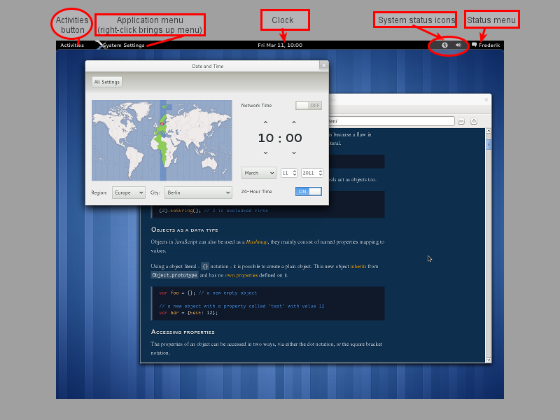
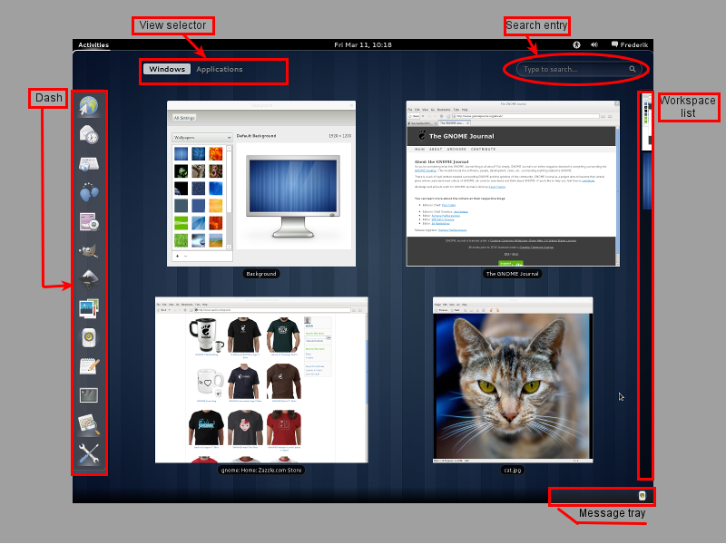
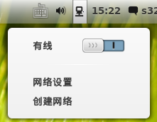
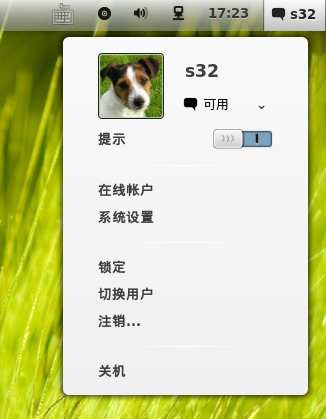
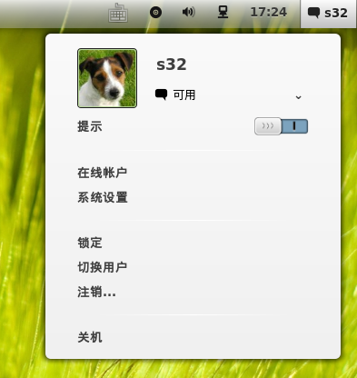
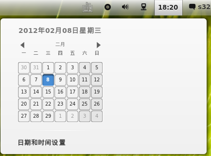
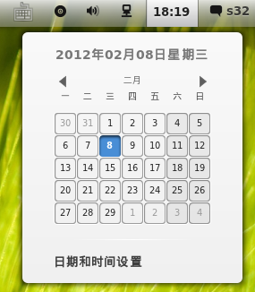

跟我一起修改 Gnome Shell theme
============================

Gnome Shell 主题是由 CSS 控制的，只要了解 CSS 相关基础知识和熟悉 Gnome Shell 组件，自己动手就可以修改Gnome Shell 主题。

## 预备知识
- CSS知识简述
- Gnome Shell 组件架构
- 相关操作快捷键提示

### CSS 知识简述
站点：[英文](http://www.w3schools.com/css/) 和 [中文](http://www.w3school.com.cn/css/)。

CSS 指层叠样式表（Cascading Style Sheets）；

CSS 选择器结构：



不再赘述!

提示：工欲善其事，必先利其器。当然，在本篇教程中，不需要太多的 CSS 知识，只是基本的改动。要想做一个个性化的主题，那必须有几把刷子才行！

### Gnome Shell 组件架构说明（Gnome Shell术语）
信息及图片来源：http://live.gnome.org/GnomeShell/Terminology。

#### 主桌面（Main desktop）


主要包括下面部分：

- `顶部栏（Top bar）`：桌面顶部的水平栏（`js/usi/panel.js`）;
- `活动按钮(Activities button）`：热键区域（Hot Corner)，点击或将鼠标甩到此处时你将看到预览（Overview）（`js/ui/panel.js`）;
- `应用菜单（Application menu）`：显示目前激活的应用的名称（`js/ui/panel.js`）;
- `时间（Clock）`：显示日期、时间（`js/ui/dateMenu.js`）;
- `系统状态图标（System status icons）`：主要包括通用辅助功能、蓝牙、键盘布局（`js/ui/status/*`）;
- `用户状态菜单（Status menu）`：在此修改你的 IM 状态（如可用、不可用、空闲等），系统设置，还有“关机”等设置(`js/ui/statusMenu.js`)；
- `信息托盘（Message tray）`：位于桌面底部的水平栏，比如邮件通知、挂在分区、IM 信息等都在此显示，可自动隐藏（`js/ui/messageTray.js`）;

#### 预览（Overview）


预览，就是点击屏幕左上角的 `活动按钮` 或将鼠标甩到屏幕左上角看到的。

配置文件主要在 `js/ui/overview.js`。

主要包括：

- `Dash`：左侧的垂直条，显示收藏应用和正在运行的应用（`js/ui/dash.js`）;
- `查看选择器（View selector）`：如窗口、应用程序、User theme等（`js/ui/viewSelector.js`,该文件嵌入在 `js/ui/overview.js` 中）；
- `搜索框（Search entry）`： 在此输入，可搜索联系人、文件、应用程序等（`js/ui/viewSelector.js` 的entry 部分，搜索结果配置文件为 `js/ui/searchDisplay.js`）;
- `工作区列表（Workspace list）`：图示的右侧垂直区域，显示激活的工作区的缩略图（`js/ui/workspaceSwitcherPopup.js`）;

### Gnome Shell 操作快捷键
在调试 Gnome Shell 主题过程中，我们常用的就是改变主题 CSS 后，重载 Gnome Shell 主题。

这里，很多童鞋一般地做法：**`Alt+F2`**，输入 **`r`**，其实这是重启 Gnome Shell。

重载主题时，我们不必重启 Gnome Shell：**`Alt+F2`**, 输入 **`rt`**，就是 ”reload theme”。

如果在调试过程中 Gnome Shell 挂掉，可以使用下面的方法：

- 按下 `Ctrl+Alt+F1`，登陆 tty1；
- 输入 `export DISPLAY=:0`
- 输入 `gdb /usr/bin/gnome-shell`
- 在 Gdb 中输入 `r --replace`
- 按下 `Alt-F7`，重回图形界面


## 修改 Gnome Shell 主题

**提示**

    1em = 16px

### 主题文件
- Gnome Shell 默认主题为 **`/usr/share/gnome-shell/theme/gnome-shell.css`**
- Gnome Shell 自定义主题在 **`~/.themes`** 目录

一般 Gnome Shell 主题文件主要包括：`gnome-shell.css`、`theme.json`、`背景图片`，还包括`作者信息`、`Changelog`、`协议文件`等。

我们这里以 Gnome Shell 主题 `Adwaita-White` 为例讲解我们将要进行的修改，也适用于其他 Gnome Shell 主题。

`theme.json` 内容包括主题的信息：
```js
{
    "shell-theme": {
        "name": "Adwaita-White", /*主题名称*/
        "author": "Oberon", /*作者*/
        "version": "1.4",/*主题版本*/
        "type": "custom",/*风格类型*/
        "disabled": false,
        "thumbnail": "preview.jpeg",/*预览图*/
        "url": "http://3.bp.blogspot.com/-bX-GCRnAGlQ/TfJ1XYxqpWI/AAAAAAAAAZY/cezQ_MySG1w/s400/adwaita3.jpg"/*相关链接*/
        }
}
```

最重要的是 `gnome-shell.css` 文件，它决定着主题设置。

### gnome-shell.css 文件分析
我们只对主题造成重大影响的地方进行分析。

#### A 信息描述
一些注释，描述当前主题的一些信息。

#### B 全局字体设置
```css
stage {
    font-family:  cantarell, sans-serif;
}
```

字体需设置为系统已安装的，否则效果显示不出来。这里我们可以添加其他字体如`文泉驿微米黑`、`serif`等字体。
```
stage {
    font-family:  "WenQuanYi Micro Hei", serif, cantarell, sans-serif;
}
```

#### C 开/关(On/Off)
```css
.toggle-switch {
    width: 4.5em;
    height: 1.5em;
}

.toggle-switch-us {
    background-image: url("toggle-off-us.png");
}
.toggle-switch-us:checked {
    background-image: url("toggle-on-us.png");
}

.toggle-switch-intl {
    background-image: url("toggle-off-intl.svg");
}
.toggle-switch-intl:checked {
    background-image: url("toggle-on-intl.svg");
}
```
这部分主要是设置 `开/关` 背景图片，如网络有线开关、用户信息提示开关。如图：



#### D 顶部面板设置
```css
#panel {
    background-gradient-direction: vertical;/*背景渐变方式，也可为horizontal,效果明显不同*/
    background-gradient-start: rgba(255,255,255,0.9);/*渐变起始色和亮度*/
    background-gradient-end: rgba(200,200,200,0.4);/*渐变结束色和亮度*/
    border: 1px solid rgba(0,0,0,0.2);/*面板边框设置*/
    border-top: 0px;
    border-bottom: 0px;
    border-left: 0px;
    border-right: 0px;
    color: rgba(22,22,22,0.8);
    font-size: 10pt;
    box-shadow: 0px 0px 6px 4px rgba(0,0,0,0.6);
    height: 32px;/*面板高度，下面会用到这个属性*/
    border-radius: 4px;/*面板圆角大小，0值无圆角*/
}
```
提示：很多同学在 Deepin 11.12 下，更换 Gnome Shell 主题时，出现顶部面板图标突出的问题，于是有了不爽的感觉。其实，这里有设计者的用心。不是用心让你不爽，是考虑到了如果顶部面板高度设置太小，不方便用户鼠标点击。于是“冒天下之大不韪”，将顶部面板高度值设置较高。

**原因分析：**

`/usr/share/gnome-shell/theme/gnome-shell.css` 中 `Panel` 的 `height` 高度默认为 `32px`，当你安装的自定义主题 `panel` 高度比 `32px` 小时，系统显示以 `/usr/share/gnome-shell/theme/gnome-shell.css` 中的设置为准，因此会出现顶部面板图标突出，与面板不统一的“Bug”。

**解决方法**

##### 治标
每当应用一个 Gnome Shell 主题时，需要修改自定义主题的 `gnome-shell.css` 文件里面的 `panele height` 值为`32px`，才能解决上述“Bug”。

##### 治本
修改 `/usr/share/gnome-shell/theme/gnome-shell.css` 文件中的 `panel height`，建议设置为`23px～25px` 之间。该布操作需要管理员权限！

#### E 顶部面板右侧
```css
.panel-button {
    border: 1px transparent;
    -natural-hpadding: 2px; /*顶部面板右侧 status icon 间距*/
    -minimum-hpadding: 2px; /*顶部面板右侧 status icon 最小间距值*/
    text-shadow: rgba(255,255,255,0.4) 0px 1px 0px;
    transition-duration: 10;
}
```

我们来对比下效果：

前（`-natural-hpadding: 2px; -minimum-hpadding: 2px;`）


后（`-natural-hpadding: 8px; -minimum-hpadding: 2px;`）


#### F 用户状态（Status menu）
```css
.status-chooser {
    spacing: 1em;
}

.status-chooser .popup-menu-item,
.status-chooser-combo .popup-menu-item {
    border: 1px; /*need this to keep combobox from jumping around*/
    padding: .4em;
}
……
……
.status-chooser-user-name {
    font-weight: bold;
    font-size: 1.3em;
    min-width: 60pt; /*用户菜单最小宽度*/
}
……
……
.system-status-icon {
    icon-size: 1.14em;
}
```

在有注释的一句，`min-width` 用来设置用户菜单宽度。

下面我们来个对比：

前（min-width: 60pt）




后（min-width: 120pt）




#### G Overview
```css
.workspace-controls {
    visible-width: 15px; /*1-工作分区隐藏时可见宽度*/
}

.workspace-thumbnails-background {/*2-工作分区显示效果，workspace*/
    padding: 20px;;
    background-gradient-direction: horizontal;
……

}

……

.window-caption { /*按下Windows 键，看到的窗口显示效果*/
    background-gradient-direction: vertical;
    background-gradient-start: rgba(251,251,251,1);
    background-gradient-end: rgba(194,194,194,0.4);
    border: 1px solid rgba(0,0,0,0.2);
    border-radius: 4px;
    color: #222;
    font-size: 9pt;
    padding: 2px 8px;
    -shell-caption-spacing: 4px;
    box-shadow: 0px 0px 4px 2px rgba(0,0,0,0.6);
}
```

#### H Apps
```css
.icon-grid {
    spacing: 5px;
    -shell-grid-item-size: 96px; /*图标间隔*/
}

.all-app .overview-icon {
    icon-size: 48px; /*预览中图标大小*/
}
```
提示：原生 Gnome Shell 预览时，图标很大，如果觉得不太舒服，可以在此设置预览时 `应用分类` 图标大小即可。

#### I 其它

`.app-filter` 为 `应用分类` 设置选项。

`.contact` 为 `联系人设置`。

```css
/* Calendar popup */
#calendarArea {
    /* this is the width of the entire popup */
    width: 400px; /* 如果点击时间，右侧显示留白太多，注释掉该语句 */
}
```

**注释前**



**注释前**



其他设置很容易理解了，不再赘述！

------

From:

- [跟我一起修改 Gnome Shell 主题(1)](http://blog.deepin.org/2012/02/customize-gnome-shell-theme-1/)
- [跟我一起修改 Gnome Shell 主题(2)](http://blog.deepin.org/2012/02/customize-gnome-shell-theme-2/)
- [跟我一起修改 Gnome Shell 主题(3)](http://blog.deepin.org/2012/02/customize-gnome-shell-theme-3/)
