Linux系统编程开发
===============

UNIX 和 C 标准之间的关系

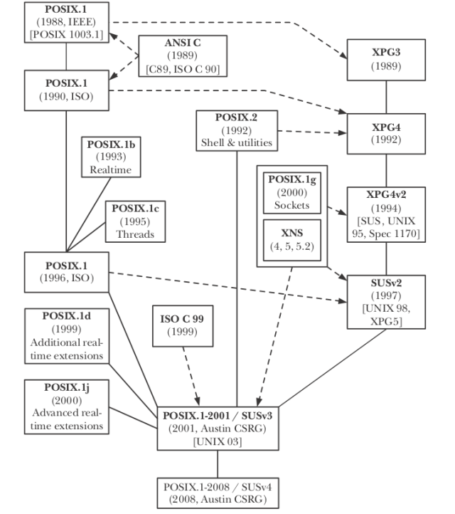

由上图可知，目前做 UNIX 系统编程，标准可以参照 `SUSv4`；除非另有说明，下文默认按 `SUSv3` 或 `SUSv4` 标准。

**参考：**

《Linux/Unix系统编程手册（中文版）》，Michael Kerrisk 著，郭光伟、陈舸 译，人民邮电出版社，2014年1月。


## 1、系统调用
**`所有的系统调用都是原子性的`**；换句话说就是，每个系统调用都是一次性执行的，中间不会被其他的系统调用打断，在数据上可以保证其一致性，也就是说，可以使用系统调用进行同步，如：带有O_EXCL和O_CREAT标记的open系统调用可以被当作锁来使用，以保证数据的同步。


## 2、线程特有数据
线程可以有特有数据。对于特有数据，每个线程都会一个副本。线程特有数据拥有一份独立的API。


## 3、线程局部存储
线程也可以拥有局部存储（非标准特性）。类似于线程特有数据，线程局部存储也为每个线程提供了持久性的存储。相比特有数据，局部存储的主要优点是，使用更加简单：要创建线程局部变量，只需要简单地在全局或静态变量的声明中包含 `__thread` 说明符即可，如：
```c
static __thread buf[BUF_SIZE];
```
**`凡是带有 __thread 说明符的变量，每个线程都拥有一份变量的拷贝`**。另外，**`线程局部存储中的变量将一直存在，直至线程终止，届时会自动释放这一存储。`**

关于线程局部变量的声明和使用，有以下要点：

    (1) 如果变量声明中使用了关键字 static 或 extern，那么关键字 __thread 必须紧跟其后；
    (2) 与一般的全局或静态变量声明一样，线程局部变量在声明时可设置一个初始值；
    (3) 可以使用 C 语言取址操作符（&）来获取线程局部变量的地址。

注意：对于Linux内核，线程局部变量需要内核（由Linux 2.6 以上版本提供）、Pthread实现（由NPTL提供）以及 C 编译器（在X86-32平台上由 GCC 3.3 或后续版本提供）的支持。


## 4、僵尸线程
同“僵尸进程”一样，多线程也会出现“僵尸线程”。为了防止僵尸线程，可以使用以下方法：

    (1) 使用 pthread_detach 函数将线程分离；分离后的线程无法再获取其返回状态，但线程终止时会自动被清理以防止僵尸线程的产生。
    (2) 使用 pthread_join 函数来连接线程，等线被连接的线程的接束，并清理结束的线程并获取其返回状态。

**注：**

    (1) 不同于多进程，多线程之间的关系是对等的，没有层次关系；
    (2) 任何线程都可以调用 pthread_join 函数。
    (3) 如果 pthread_join 函数连接的指定的线程没有结束，pthread_join函数将会被阻塞；如果已经结束，pthread_join会立即返回。
        为了防止因 pthead_join 被阻塞而导致该线程无法完成后续的工作，但又要防止僵尸线程的产生，可以在主线程或其他某个线程完成
        已经要处理的工作之后，对其他线程执行 pthread_join 函数。


## 5、线程取消点
如果一个线程的状态是 `PTHREAD_CANCEL_ENABLE`（默认状态）且类型为 `PTHREAD_CANCEL_DEFERED`（默认类型），那么当该线程收到 `CANCEL` （取消）请求时，并不会立即结束；只有当该线程到达 `下一个` **`取消点`** 之后，才会结束；如果该线程一直到达不了下一个取消点，那么线程就一直不会结束，如：线程执行的是一个不含取消点的循环，尤其是计算密集型（死）循环。

为了让线程自动的产生一个取消点，该线程可以主动调用 `pthread_testcancel` 函数；如果该线程已经处于挂起状态的取消请求，那么只要调用该函数，线程就会随之终止。

注：对于一个线程的取消点，请参见 `SUSv3` 或 `SUSv4` 标准的规定。


## 6、线程异步取消
如果线程被设定为 `PTHREAD_CANCEL_ASYNCHRONOUS`（异步取消）状态，那么该线程在收到取消消息时，可以在任何时间点（即执行任何机器指令时）结束，而不会延迟到下一个取消点。

如果线程处于异步取消，尽管当线程结束之前可以执行清理函数，但处理函数仍然无法得知线程的具体状态。

作为一般性原则，**`可异步取消的线程不应该分配任何资源，也不能获取互斥量或锁`**；这导致在该线程中无法使用大量的库函数。

异步取消功能的应用场景很少，其中之一是：取消在执行计算密集型循环的线程。


## 7、线程和进程控制
### （1）线程和 exec()
只要有任一线程调用了 `exec()` 系列函数之一时，调用程序将被完全替换；除了调用 `exec()` 的线程之外，其他所有线程都将立即消失。没有任何线程会针对线程特有数据执行析构函数（destructor，在创建特有数据时，可以为特有数据指定一个析构函数，当线程结束时会自动调用析构函数来释放一些资源），也不会调用清理函数（cleanup handler，每个线程都可以指定一个或多个清理函数，当线程结束时，会以LIFO方式来调用清理函数，来释放或清理一些资源）。另外，该进程的所有互斥量（为进程所私有）和属于进程的条件变量也都会消失；而且，调用 `exec()` 之后，调用线程的线程ID是不确定的。

### （2）线程和 fork()
当多线程进程调用 `fork()` 时，仅会将发起调用的线程复制到子进程中，其他线程均在子进程中消失，另外，也不会为这些线程调用清理函数和针对线程特有数据的析构函数。

注：子进程中发起 `fork` 系统调用的线程的线程ID与父进程中发起 `fork` 系统调用的线程的线程ID是一致的。

当一个线程调用 `fork` 系统调用时，其他线程将消失且不会调用清理函数和特有数据的析构函数，因此会出现种种问题。**`推荐在多线程程序中调用 fork 的唯一情况是：其后紧跟对 exec 的系统调用`**。`因为新程序会覆盖原有的内存，exec 系统调用将导致子进程的所有 pthread 对象消失`。

如果多线程中必须执行 `fork` 系统调用，但又没有 `exec` 系统调用，那么，可以使用 Pthread API 提供了的另一种机制：`fork 处理函数`。
```c
pthread_atfork(prepare_func, parent_func, child_func);
```
每一次调用 `pthread_atfork` 调用都会将 `prepare_func` 添加到一个函数列表中，在调用 `fork` 系统调用创建新的子进程之前，会（按与注册次序相反的顺序）自动执行该函数列表中的函数。与之类似，会将 `parent_func` 和 `child_func` 添加到另外的函数列表中，在 `fork` 系统调用返回之前，将分别在父、子进程中（按注册的顺序）分别自动运行。

注：调用 `fork` 系统调用所产生的子进程从调用 `fork` 系统调用的线程处继承 `fork` 处理函数；执行 `exec` 系统调用期间，`fork处理函数`将不再保留（因为处理函数的代码会在执行 `exec` 系统调用的过程中遭到覆盖）。

### （3）线程和 exit()
如果任何线程调用了 `exit()`，或者主进程执行了 `return`，那么所有线程都将消失，也不会执行线程的清理函数和特有数据的析构函数。


## 8、线程与信号
UNIX 信号模型是基于 UNIX 进程模型而设计的，问世比 Pthread 要早几十年；自然而然，信号比线程模型之间存在一些明显的冲突。信号与线程模型之间的差异意味着，将二者结合使用，将会非常复杂，应尽可能加以避免。

### （1）UNIX 信号模型映射到线程模型中的规则
1）**`信号动作属于进程层面`**。如果某进程的任一线程收到任何未经（特殊）处理的信号，且缺省动作为 stop 或 terminate，那么将停止或终止该进程中的所有线程。

2）**`对信号的处理属于进程层面，进程中的所有线程共享对每个信号的处理设置`**。如果某一线程使用函数 sigaction( ) 为某类信号创建了处理函数，那么当收到该信号时，任何线程都会去调用该处理函数；与之类似，如果将对信号的处理设置为忽略，那么所有线程都会忽略该信号。

3）信号的发送既可以针对整个进程，也可以针对某个特定的线程。满足以下三者之一的信号当属面向线程的：

    a. 信号的产生源于线程上下文中对特定硬件指令的执行，如：SIGBUS、SIGFPE、SIGILL 和 SIGSEGV 等。
    b. 当线程试图对已断开的管道进行写操作时所产生的 SIGPIPE 信号。
    c. 由函数 pthread_kill 或 pthread_sigqueue 所发出的信号，这些函数允许线程向同一进程下的其他线程发送信号。
    由其他机制产生的所有信号都是面向进程的。

4）**`当多线程程序收到一个信号，且该进程已然为此信号创建了信号处理程序时，内核会任选一条线程来接收这一信号，并在该线程中调用信号处理程序对其进行处理。`**这种行为与信号的原始评议一致。

5）**`信号掩码是针对每个线程的。`**对于多线程程序来说，并不存在一个作用于整个进程范围的信号掩码，可以管理所有线程。使用pthread API 所有定义的函数 `pthread_sigmask`，各线程可以独立阻止或放行各种信号。通过操作每个线程的信号掩码，应用程序可以控制哪些线程可以处理进程收到的信号。但是，**`刚创建的新线程会从其创建者处继承信号掩码的一份拷贝。`**

6）针对为整个进程所挂起（pending）的信号，以及为每条线程所挂起的信号，内核都分别维护有记录。调用函数 `sigpending` 会返回为整个进程和当前线程所挂起信号的并集。**`在新创建的线程中，每线程的挂起信号集合会被初始化为空`**。可将一个针对线程的信号仅向目标线程投送；如果该信号遭到线程阻塞，那么它会一直保持挂起，直到线程将其放行（或者线程终止）。

7）如果信号处理程序中断了对 `pthread_mutex_lock()` 的调用，那么该调用总是会自动重新开始。如果一个信号处理函数中断了对`pthread_cond_wait()`的调用，则该调用要么自动重新开始（Linux 内核就是如此），要么返回0，表示遭遇了假唤醒。

8）**`备选信号栈是每个线程所特有的。新创建的线程并不从创建者处继承备选信号栈。`**更确切地说，SUSv3规定每个内核调用实体（KSE）都有一个单独的备选信号栈。

### （2）妥善处理异步信号
由于各种因素（如，可重入问题，重启遭中断的系统调用，以及避免竞争条件等等），当使用信号处理函数对异步产生的信号加以处理时，这些都将导致情况变得复杂。另外，没有任何 Pthread API 属于异步信号安全函数，均无法在信号处理函数中安全加以调用。因为这些原因，所以当多线程应用程序必须处理异步产生的信号时，通常不应该将信号处理函数作为接收信号到达的通知机制。

相反，推荐下面的方法：

    (1) 所有线程都阻塞进程可能接收的所有异步信号。最简单的方法是，在创建任何其他线程之前，由主线程阻塞这些信号；
        后续创建的每个线程都会继承主线程信号掩码的一份拷贝。
    (2) 再创建一个专用线程，调用函数 sigwaitinfo、sigtimedwait 或 sigwait 来接收收到的信号。

这一方法的优势在于，同步接收异步信号产生的信号。当接收到信号时，专有线程可以安全地修改共享变量（在互斥量的保护之下），并可调用并非异步信号安全的函数。也可以就条件变量发出信号，并采用其他线程或进程的通讯及同步机制。


## 9、进程
**`在执行 fork() 系统调用时，子进程会获得父进程所有文件描述符的副本`**；这些副本的创建方式类似于`dup()`，这意味着父、子进程中对应的描述符均指向相同的打开文件句柄（open file description），打开文件句柄包含有当前文件偏移量以及文件状态标志等，如果子进程更新了文件偏移量，那么这种改变也会影响到父进程中相应的文件描述符。

如果不需要这种对文件描述符的共享方式，那么在设计应用程序时，应于 `fork()` 系统调用后注意两点：一是，令父、子进程使用不同的文件描述符；二是，**各自立即关闭不再使用的文件描述符**。

当调用 `fork()` 系统调用之后，无法确定父、子进程间谁将率先访问CPU。虽然不知道父、子进程到底谁先被调度，但是内核必须在此时对进程进行一次调度；到底由内核先调度子进程还是父进程，Linux 内核有些变化。

早期，Linux 内核在 fork() 之后优先调度父进程。后来，有人提出并支持 “**`fork() 之后应优先调度子进程`**”，其原由是考虑到，fork() 产生的子进程立即执行 exec() 系统调用时“写时复制”所发生的情况（Linux内核对 fork() 系统调用的实现使用“copy on write”机制）。到 2.6.32 版本，Linux内核又改回了“**`fork() 之后优先调度父进程`**”，其论据则基于如下发现：fork() 之后，父进程在CPU中正处于活跃状态，并且其内存管理信息也被置于硬件内存管理单元的转译后备缓冲区（TLB，translation look-aside buffer）中，所以，先运行父进程将提高性能。在非正式场合下，针对分别采取上述两种行为的内核构建版本进行了时间度量，其结果也证实了这一点。

总之，值得强调的是：两种行为间的性能差异很小，对于大部分应用程序并无影响。

注：上述“**`fork() 之后优先调度子进程`**”和“**`fork() 之后优先调度父进程`**”是指在 fork() 系统调用之后，内核在对进程执行 schedule 时，应先 schedule 谁——先调度谁，谁先运行的机率就会大。注意，是**`机率会大`**，并不是一定先运行（对于用户的感知），比如：如果先调度父进程，但并不代表父进程一定先于子进程运行——如果父进程在被调度时，因阻塞而休眠（或因其他情况而导致父进程无法即时运行），那么就有可能子进程先于父进程运行，不过这种机率比较小。因此，虽然优先被调度，并代表一定会先运行，但其先运行的机率比较大，实验表明高达99%。

如果多进程间需要信赖父、子进程间先后运行来编码， 那么就必须采用某种同步技术了。


## 10、进程的退出
进程的终止有两种方式：一是**`异常（abnormal）终止`**，由对一信号的接收而引发，该信号的默认动作为终止当前进程，可能产生核心转储（core dump）；二是**`正常（normal）终止`**，通过调用 `_exit()` 系统调用来实现。

`exit()` 函数是由库函数实现（C标准中有规定），其执行的动作如下：

    (1) 调用退出处理程序（通过 atexit() 和 on_exit() 注册的函数），其执行顺序与注册顺序相反；
    (2) 刷新 stdio 流缓冲区；
    (3) 使用由 status 提供的值执行 _exit() 系统调用。

注：在 `main` 主函数中执行 `return n` 等同于对 `exit(n)` 的调用。

**进程终止的细节**（无论进程是否正常终止，都会发生如下动作）：

    (1) 关闭所有打开的文件描述符、目录流、信息目录描述符（man catopen(3) 和 catgets(3)），以及（字符集）转换描述符
        （man iconv_open(3)）；
    (2) 作为文件描述符关闭的后果之一，将释放该进程所持有的任何文件锁；
    (3) 分离（detach）任何已连接的 System V 共享内存段，且对应于各段的 shm_nattch 计数器值将减一；
    (4) 进程为每个 System V 信号量所设置的 semadj 值将会被加到信号量值中；
    (5) 如果该进程是一个管理终端（terminal）的管理进程，那么系统会向该终端前台（foreground）进程组中的每个进程发送 SIGHUP
        信号，接着终端会与会话（session）脱离；
    (6) 将关闭该进程打开的任何 POSIX 有名信号量，类似于调用 sem_close()；
    (7) 将关闭该进程打开的任何 POSIX 消息队列，类似于调用 mq_close()；
    (8) 作为进程退出的后果之一，如果某进程组成为孤儿，且该组中存在任何已停止进程，则组中所有进程都将收到 SIGHUP 信号，
        随之为 SIGCONT 信号，类似于向这些进程都先后发送 SIGHUP 和 SIGCONT 信号；
    (9) 移除该进程通过 mlock() 或 mlockall() 所建立的任何内存锁；
    (10) 取消该进程调用 mmap() 所创建的任何内存映射。

**注：**

    A. 根据(10)第条我们可知道，尽管一个程序发生了“内存泄漏”，当该程序结束时，其所申请的内存（包括泄漏的内存）会全部归还给
       操作系统。也就是说，“内存泄漏”只发生在程序运行期间；程序一旦结束，就不再有“内存泄漏”一说。
    B. 如果进程向操作系统提出释放这块内存的请求，对于这个请求，不同的系统的反应是不一样的：有的系统可能会立即释放；
       有的系统（如 linux 等）不会释放，仍然把这块内存空间作为进程专有空间（即此时系统不会把这块内存空间分配给其它进程使用），
       但是却标定为“已释放”，进程在下一次向操作系统申请空间的时候，系统会优先考虑这块“已释放”的空间，这样做的目的是加快内存
       分配的速度。
    C. 为了测试 B，可以使用以下原理：一个程序只能访问操作系统为其分配的内存，否则，将会出现段错误（Segmentation Fault）。
       如果操作系统会立即释放 free 的内存，那么就会出错段错误；否则，就不会出错，即还可以访问被释放的内存。

**退出处理函数**（使用 `atexit()` 或 `on_exit()` 注册的函数）：

    (1) 可以注册多个退出处理函数（甚至可以将同一个函数注册多次），当应用程序调用 exit() 函数时，这些函数的执行顺序与注册顺序
        相反。
    (2) 本质上，可以在退出处理函数中执行任何希望的动作，包括注册附加的退出处理函数，并将其置于留待调用的剩余函数列表的头部。
    (3) 一旦有任何一个退出处理函数无法返回——无论是因为调用了 _exit() 系统调用还是进程因收到了信号而终止，那么就不再调用剩余的
        处理函数。
    (4) 通过 fork() 系统调用创建的子进程会继承父进程注册的退出处理函数。而进程调用 exec() 时，会移除所有已注册的退出处理函数。
    (5) 无法取消已经由 atexit() 或 on_exit() 注册的退出处理函数。
    (6) SUSv3规定，系统实现应允许一个进程能够注册至少32个退出处理函数。Linux可以注册2147482647（32位有符号整数的最大值）。
    (7) SUSv3规定，若退出处理函数自身调用 exit()，其结果未定义。

注：`atexit()` 是在C标准和SUSv标准中规定的，而 `on_exit()` 是glibc提供的非标准接口——为了替代 `atexit()`。


## 11、进程的执行
对于 `execve()` 系统调用，成功调用时将永不返回，而且也无需要检查 `execve()` 的返回值，因为该值总是等于`－1`。实际上，一旦返回，就表明发生了错误。

### 文件描述符与 exec()
默认情况下，由 `exec()` 的调用程序所打开的所有文件描述符在 `exec()` 的执行过程中会保持打开状态，且在新程序中依然有效。

如果文件描述符在打开时使用了`执行时关闭标志（close-on-exec）`，那么当使用 `dup()`、`dup2()` 或 `fcntl()` 为一文件描述符创建副本时，总是会清除副本描述符的执行时关闭标志。

### 信号与 exec()
为了保持更大的可移植性，在调用 `exec()` 之前，应该执行 `signal(SIGCHLD, SIG_DEF)`；另外，程序也不应当假设对 `SIGCHLD` 处理的初始设置是 `SIG_DEF` 之外的其他值。

`exec()` 在调用期间不会保护备选信号栈，因此也会将所有信号的 `SA_ONSTACK` 位清除掉。

在调用 `exec()` 期间，进程信号掩码以及挂起（pending）的信号的设置均得以保存。这一特性允许对新程序的信号进行阻塞和排队处理。

### 进程抢占
#### 用户空间抢占发生在
    (1) 从系统调用返回用户空间时；
    (2) 从中断处理程序返回用户空间时。

#### 内核空间抢占发生在
    (1) 中断处理程序正在执行，且返回到内核空间之前；
    (2) 内核代码再一次具有可抢占性时；
    (3) 内核中的任务显式地调用schedule()函数；
    (4) 内核中的任务阻塞（原因是：它会导致调用schedule()函数）。


## 12、僵尸进程和孤儿进程
当父进程没有调用 `wait()` 系统调用而结束，但其子进程还未结束时，此时该父进程的所有子进程都会成为孤儿进程，那么这些孤儿进程将交由其祖先——`init` 进程（进程号为1，所有其他进程的祖先）——来接收，即 `init` 进程成为这些孤儿进程的父进程。

如果在父进程结束之前，子进程已经结束，而且父进程也没有调用 `wait()`、`waitpid()` 或 `waitid()` 等系统调用，那么该父进程的、已经结束的子进程就成为了僵尸进程。

当孤儿进程结束时，`init` 进程会自动对其回收；但僵尸进程所占用的进程资源却无法得到回收。这将会造成一些其他的影响，如：不能创建更多的进程。

无论子进程何时终止，都会向其父进程发送 `SIGCHLD` 信号。

#### 防止僵尸进程的产生
    (1) 在父进程调用 wait() 系统调用——它将一直等待，直到其子进程终止为止；（这种方法不是很好）
    (2) 在父进程调用 waitpid() 或 waitid() 系统调用；（这种方法和wait差不多，也不是很好）
    (3) 显式的将 SIGCHLD 信号的处理设置为 SIG_IGN；
    (4) 在父进程中设置 SIGCHLD 信号处理函数，并在其内部循环以 WNOHANG 标志来调用waitpid()，直到再无其他终止的子进程
        需要处理为止。通常 SIGCHLD 处理函数都简单地由以下代码组成，仅仅捕获已终止的子进程而不关心其退出状态：
            while(waitpid(-1, NULL, WNOHANG) > 0) continue;

**注：**

    A. 在第（3）种方法中，其原理是，将 SIGCHLD 信号的处理显示地设置为 SIG_IGN，系统从而会将其后终止的子进程立即清理掉，
       不会使其成为僵尸进程。
    B. 在第（4）种方法中，在安装 SIGCHLD 信号处理函数时，最好使用 sigaction() 函数，并且设置 SIGCHLD 掩码，
       即在执行 SIGCHLD 信号处理函数时，对再次到来的 SIGCHLD 信号执行挂起操作，等 SIGCHLD 处理函数执行完后，再次引发
       SIGCHLD 信号的处理。
    C. 要防止僵尸进程的产生，唯一完全可移植的方法就是调用 wait() 或者 waitpid() 系统调用。


## 13、信号
信号分为两大类：一是传统或标准信号，用于内核向进程通知事件，Linux 中标准信号的编号范围是 1 ～ 31；二是实时信号。

信号因某事件而产生。信号产生后，会于稍后被传递给某一进程，而进程也会采取某些措施来响应信号。在产生和到达期间，信号处于等待（pending）状态。

无法将信号处理设置为终止进程或转储核心（除非这是对信号的默认设置）。但效果最为近似的是，为信号安装一个处理函数，并于其中调用 `exit()` 或 `abort()`。

信号处理函数是当指定的信号传递给进程时将会调用的一个函数。调用信号处理函数，可能会随时打断主程序流程；内核代表进程来调用信号处理函数，当信号处理函数返回时，主程序会在被信号打断的位置恢复执行。

一般而言，将信号处理函数设计得越简单越好。其中的一个重要原因就在于，这将降低引发竞争条件的风险。

针对信号处理函数的设计常见有两种：

    (1) 信号处理函数设置全局性标志变量并退出。主程序对此标志进行周期性检查，一旦置位随即采取相应的动作。
    (2) 信号处理函数执行某种类型的清理动作，接着终止进程或者使用非本地跳转将栈解开并将控制返回到主程序中的预定位置。

#### 系统调用的中断和重启
默认情况下，当系统调用被阻塞时，如果此时有信号被产生并捕获，那么此信号会中断该系统调用——系统调用会在信号处理函数返回时失败，并将 `errno` 置为 `EINTR`。

为了重启被信号中断的系统调用，有以下两种方法：

    (1) 如果系统调用失败（返回一个失败值），则检查errno值，如果为EINTR，则重新调用该系统调用；如下面代码：
        while((cnt = read(fd, buf, BUF_SIZE)) == -1 && errno == EINTR) continue;
    (2) 使用 sigaction() 来安装信号处理函数，并指定 SA_RESTART 标志；此时如果系统调用由于该信号而被中断，
        那么内核会自动重启该系统调用。

注：标志 `SA_RESTART` 需要针对每个信号进行设置。另外，并非所有的系统调用都可以通过指定 `SA_RESTART` 来达到重启的目的。

#### signal() 的实现及可移植性
由 signal() 安装的信号处理器有以下特点：

    （1）没有重启功能；
    （2）一进入信号处理函数，系统会将信号处理重围为其默认行为。要想在同一信号“再度光临”时再次调用该信号处理函数，
        程序员必须在信号处理函数内部再次调用 signal()，以显式地重建信号处理函数。
        这种情况存在一个问题：在进入信号处理函数和重新安装信号处理函数之间存在一个短暂的间隔期，而如果同一信号在此期间再度
        来袭，那么将只能按照其默认设置来进行处理。
    （3）在信号处理函数执行期间，不会对新产生的信号进行阻塞。这意味着，如果在某一信号处理函数执行期间，同类信号再度光临，
        则将对该信号处理函数进行递归调用。假定一串信号中彼此的时间间隔足够短，那么对信号处理函数的递归调用将可能导致堆栈溢出。

**注：**

    (1) glibc 库则利用 sigaction() 实现了 signal() 库函数。
    (2) sigaction() 是建立信号处理函数的首先 API。
    (3) 如果是将信号的处理设置为默认设置（SIG_DEF）或忽略（SIG_IGN），则使用 signal() 则很方便的，同时也不会丧失良好的
        可移植性。

#### 标准信号
**`正处于等待但还没有处理的标准信号，如果多次传递，那么只引发一次处理`**。因为标准信号使用的是掩码（Mask）来管理。

#### 实时信号
相比标准信号，实时信号有如下优势：

    (1) 实时信号的信号范围有所扩大，且可应用于应用程序自定义的目的。标准信号中可供应用程序随意使用的信号仅有两个：
        SIGUSR1 和 SIGUSR2。
    (2) 对实时信号所采取的是队列化管理。如果将某一实时信号的多个实例发送给一进程，那么将会多次传递信号。
    (3) 当发送一个实时信号时，可为信号指定伴随数据（一个整型数或指针值），供接收进程的信号处理函数获取。
    (4) 不同实时信号的传递顺序得到保障。如果有多个不同的实时信号处于等待状态，那么将率先传递具有最小编号的信号。
        换言之，信号的编号越小，其优先级越高。
        如果是同一类型的多个信号在排队，那么信(号以及伴随数据)的传递顺序与信号发送来时的顺序保持一致。

**注：**

    (1) 指代实时信号编号时，可以采用 SIGRTMIN + x 的形式。如：表达式 (SIGRTMIN + 1) 就表示第二个实时信号。
    (2) SUSv3并未要求 SIGRTMIN 和 SIGRTMAX 是简单的整数值，可以将其定义为函数（Linux中的实现即为函数）。
        所以，必须在运行时执行等效检查。

##### 使用实时信号
    (1) 发送进程须使用sigqueue()系统调用来发送信号及其伴随数据。也可使用kill、killpg、raise来发送实时信号，但SUSv3并未规定。
    (2) 要为该信号建立了一个信号处理函数，且接收进程应以 SA_SIGINFO 标志发起 sigaction() 系统调用。


## 14、信号传递的时机与顺序
内核将等待信号传递给进程的时机是：该进程正在执行，且发生由内核态到用户态的下一次切换时。

实际上，这意味着在以下时刻才会传递信号：

    (1) 进程在前度超时后（即上一个时间片用完），再度获得调度时；此种情况即是，在一个时间片的开始处。
    (2) 系统调用完成时（信号的传递可能引起正在阻塞的系统调用过早地完成）。

注：如果进程一直不处理上述两种情况之一，那么信号处理函数永远也不会被调用、运行。

对于多个标准信号的传递顺序，SUSv3并未过多规定，仅规定：多个信号的传递顺序由系统实现来决定（该条款仅适用于标准信号）。Linux 内核目前的实现方式是，按照信号编号的升序来传递信号。

**`当多个解除了阻塞的信号正在等待被传递时，如果在信号处理函数执行期间发生了内核态和用户态之间的切换，那么将中断此信号处理函数的执行，转而去调用第二个信号处理函数`**（如此递进），就主程序中函数的递归调用一样。


## 15、系统限制
C 语言标准和 SUSv3/SUSv4 为系统限制提供了一些选项。SUSv3 定义了3个函数：`sysconf()`、`pathconf()` 和 `fpathconf()`。

SUSv3 将其规定的限制归为 3 类：`运行时恒定值`、`路径名变量值`和`运行时可增加值`。

常用的部分限制：

限制名称（\<limits.h>）  |  最小值  |   在sysconf/pathconf中的参数名（\<unistd.h>）|     描述
----------------------|---------|------------------------------------------|------------------------------------------
     OPEN_MAX         |    20   |            _SC_OPEN_MAX                  |    进程可同时打开的文件描述符的最大数量。
     NAME_MAX         |    14   |            _PC_NAME_MAX                  |    排除终止空字符外，文件名称的最大字符长度。
     PATH_MAX         |    256  |            _PC_PATH_MAX                  |    路径名称的最大字节长度，含尾部空字符。
     PIPE_MAX         |    512  |            _PC_PIPE_MAX                  |    一次性（原子操作）写入管道或FIFO中的最大字节数。

注：以 `_SC_` 开头的常量用于 `sysconf()`，以 `_PC_` 开头的常量用于 `pathconf()` 和 `fpathconf()`。


## 16、进程组、会话和作业控制
### 概念
进程组和会话在进程之间形成了一种两级层次关系：**进程组是一组相关进程的集合，会话是一组相关进程组的集合。**

进程组由一个或多个共享同一进程组标识符（PGID）的进程组成。一个进程组拥有一个进程组首进程，该进程是创建该组的进程，其进程ID为该进程组的ID，新进程会继承其父进程所属的进程组ID。

进程组拥有一个生命周期，其开始时间为首进程创建组的时刻，结束时间为最后一个成员进程退出组的时刻。一个进程可能会因为终止而退出进程组，也可能会因为加入另外一个进程组而退出进程组。进程组首进程无需是最后一个离开进程组的成员。

会话是一组进程组的集合。进程的会话成员关系是由其会话标识符（SID）确定的。会话首进程是创建该新会话的进程，其进程ID会成为会话ID。新进程会继承其父进程的会话ID。

一个会话中的所有进程共享单个控制终端。**`会话在被创建出来的时候是没有控制终端的`**，当会话首进程首次打开一个还没有成为某个会话的控制终端的终端时，才会建立控制终端，即**`控制终端是在会话首进程首次打开一个终端设备时被建立的。一个终端最多只能成为一个会话的控制终端`**。控制终端会被由 fork() 创建的子进程继承并且在 exec() 调用中得到保持。**`当会话首进程打开了一个控制终端之后，它同时也成为了该终端的控制进程。`**

`在任一时刻，会话中的其中一个进程组会成为终端的前台进程组，其他进程组会成为后台进程组`。**`只有前台进程组中的进程才能从控制终端中读取输入和写入输出`**。当用户在控制终端中输入其中一个信号生成终端字符之后，该信号会被发送到前台进程组中的所有成员。这些字符包括`生成SIGINT的中断字符（通常是Control-C）`、`生成SIGQUIT的退出字符（通常是Control-\）`、`生成SIGSTP的挂起字符（通常是Control-Z）`。

**`在 System V 中，只有会话组长（即会话首进程）才能打开并获取一个控制终端`**。（Linux也遵循了这个规则。）

**`当到控制终端的连接建立起来（即打开）之后，会话首进程会成为该终端的控制进程。成为控制进程的主要标志是当断开与终端之间的连接时内核会向该进程发送一个SIGHUP信号。`**

会话和进程组的主要用途是用于 Shell 作业控制。对于交互式登录，控制终端是用户登录的途径。登录 Shell 是会话首进程和终端的控制进程，也是其自身进程组的唯一成员。从 Shell 中发出的每个命令或通过管道连接的一组命令都会导致一个或多个进程的创建，并且 Shell 会把所有这些进程都放在一个新进程组中。

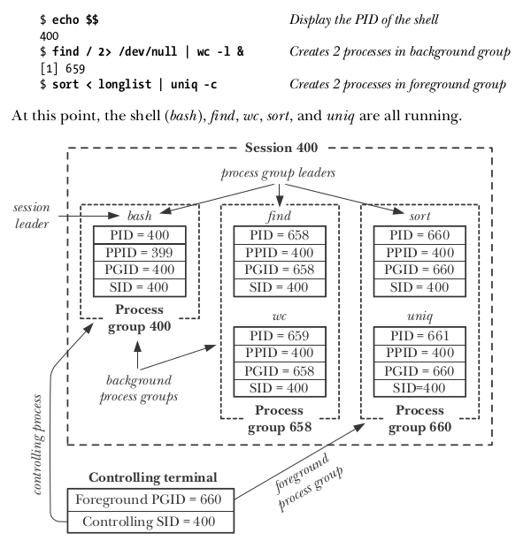

### 创建会话
```c
#include <unistd.h>
pid_t setsid(void)
```
setsid系统调用会按照下列步骤创建一个新会话：

    (1) 调用进程成为新会话的首进程和该会话中新进程组的首进程。调用进程的进程组ID和会话ID会被设置成为该进程的进程ID。
    (2) 调用进程没有控制终端。所有之前到控制终端的连接都会被断开。

注：**如果调用进程是一个进程组首进程，那么 setsid() 调用会报出 EPERM 错误**。避免这个错误发生的最简单的方式是执行一个 `fork()` 并让父进程终止以及让子进程调用 `setsid()`。由于子进程会继承其父进程的进程组ID并接收属于自己的唯一的进程ID，因此它无法成为进程组首进程。


## 17、守护进程（Daemon）
### 概述
守护进程daemon是一种具备下列特征的进程：

    (1) 它的生命周期很长。通常，一个Daemon会在系统启动时被创建并一直运行，直至系统被关闭。
    (2) 它在后台运行并且不拥有控制终端。控制终端的缺失确保了内核永远不会为Daemon自动生成任何任务控制信号以及终端相关的信号
        （如SIGINT、SIGTSTP和SIGHUP等）。

### 创建一个Daemon
    (1) 执行一个 fork()，之后父进程退出，子进程继续执行。（结果是Daemon成为了init进程的子进程。）
        之所以要做这一步是因为以下两个原因：
        A. 假设 Daemon 是从命令行启动的，父进程的终止会被 Shell 发现，Shell 在发现之后会显示出另一个 Shell 提示符，
           并让子进程继续在后台运行；
        B. 子进程被确保不会成为一个进程组首进程。
    (2) 子进程调用 setsid() 系统调用，开启一个新会话并释放它与控制终端之间的所有关联。
    (3) 如果 Daemon 从来没有打开过终端设备，那么就无需担心 Daemon 会重新请求一个控制终端了；
        如果 Daemon 后面可能会打开一个终端设备，那么必须要采取措施来确保这个设备不会成为控制终端。
        这可以通过下面两种方式来实现。
            A. 在所有可能应用到一个终端设备上的 open() 系统调用中指定 O_NOCTTY 标志。
            B. 在 setsid() 系统调用之后执行第二个 fork()，然后再次让父进程退出并让孙子进程继续执行。
                这样确保子进程不会成为会话组长。
    (4) 清除进程的 umask 以确保当 Daemon 创建文件和目录时拥有所需的权限。
    (5) 修改进程的当前工作目录，通常会改为根目录（/）。这样做是有必要的，因为 Daemon 通常会一直运行直至系统关闭为止；
        如果 Daemon 的当前工作目录为不包含 / 的文件系统，那么就无法卸载该文件系统。
    (6) 关闭 daemon 从其父进程继承而来的所有打开着的文件描述符。
        （Daemon可能需要保持继承而来的文件描述符的打开状态，因此这一步是可选的或者是可变更的。）
    (7) 在关闭了文件描述符 0、1、2 之后，Daemon 通常会打开 /dev/null 并使用 dup2() （或者类似的函数）使所有这些描述符
        都指向这个设备。之所以要这样做，有以下两个原因：
        A. 它确保了当 Daemon 调用了在这些描述符上执行 I/O 的库函数时不会出乎意料地失败。
        B. 它防止了 Daemon 后面使用描述符 1 或 2 打开一个文件的情况，因为库函数会将这些描述符当做标准输出和标准错误输出来
           写入数据，进而破坏了原有的数据。

### 编写Daemon指南
（1）由于 Daemon 并不拥有控制终端，因此内核永远不会向 Daemon 主动发送跟终端有关的信号（如SIGHUP）。鉴于此，可以为SIGHUP信号安装一个处理器，捕获SIGHUP，读取配置文件，即使用SIGHUP信号来重读配置文件。

（2）在系统关闭时，init 进程会向所有其子进程发送 SIGTERM，因此 Daemon 可以捕获此信号来做清理工作。但是这个清理工作必须快速地完成，因为 init 在发完 SIGTERM 信号 5 秒之后，紧接着会发送 SIGKILL 信号。这并意味着 Daemon 有 5 秒的清理时间，因为 init 进程会同时向系统中的所有进程发送信号，而这些进程都试图在 5 秒之内完成清理工作，因而会争用 CPU 时间。

### 一份 Daemon 样例代码
```c
/* Returns 0 on success, -1 on error */
int  becomeDaemon(void)
{
        int maxfd, fd;

        switch (fork()) {                              /* Become background process */
                case -1:  return -1;
                case 0:   break;
                default:   _exit(EXIT_SUCCESS);
        }

        if (setsid() == -1)                            /* Become leader of new session */
                return -1;

        switch (fork()) {                              /* Ensure we are not session leader */
                case -1:  return -1;
                case 0:   break;
                default:   _exit(EXIT_SUCCESS);
        }

        /* Clear file mode creation mask */
        umask(0);

         /* Change to root directory */
        hdir("/");

        /* Close all open files */
        maxfd = sysconf(_SC_OPEN_MAX);
        if (maxfd == -1)                    /* Limit is indeterminate... */
                maxfd = 1024;               /* so take a guess */
        for (fd = 0; fd < maxfd; fd++)
                close(fd);

        close(STDIN_FILENO);         /* Reopen standard fd's to /dev/null */
        fd = open("/dev/null", O_RDWR);
        if (fd != STDIN_FILENO)      /* 'fd' should be 0 */
                return -1;
        if (dup2(STDIN_FILENO, STDOUT_FILENO) != STDOUT_FILENO)
                return -1;
        if (dup2(STDIN_FILENO, STDERR_FILENO) != STDERR_FILENO)
                return -1;

        return 0;
}
```


## 18、编写安全的特权程序
### （1）是否需要一个 Set-User-ID 或 Set-Group-ID 程序？
有关编写 Set-User-ID  和 Set-Group-ID 程序的最佳建议中的一条就是尽量避免编写这种程序。

假设一个 Set-User-ID 程序需要允许用户更新一个它没有写权限的文件，那么解决这个问题的一种更加安全的方式是为这个程序创建一个专用组账号（组ID），然后将文件所属的组修改为那个组（即使得该组中的成员能够写入该文件），接着编写一个将进程的有效组ID设置为该专用组ID的set-user-ID程序。

### （2）以最小权限操作。
程序应该总是使用完成当前所执行的任务所需要的最小权限来操作，Saved 的 Set-User-ID 工具就为此而设计。

    A. 按需拥有权限
       最安全的做法是在程序启动时立即删除权限，然后在后面需要的时候临时重新获得这些权限。
       如果在某个特定的时刻之后永远不会再次请求权限时，那么程序应该删除这些权限，并通过确保 Saved Set-User-ID 的变更来
       保证程序无法再请求这些权限。
    B. 在无需使用权限时永久地删除权限
       如果 Set-User-ID 或 Set-Group-ID 程序完成了所有需要权限的任务，那么它应该永久地删除这些权限以消除任何由于程序中包含
       BUG 或其他意料之外的行为而可能引起的安全风险。永久删除权限是通过将所有进程用户（组）ID 重置为真实（组）ID来实现的。

### （3）小心执行程序
`在执行另一个程序之前永久地删除权限`。如果一个Set-User-ID（或 Set-Group-ID）程序执行了另外一个程序，那么就应该要确保所有的进程用户（组）ID 被重置为真实用户（组）ID，这样新程序在启动时就不会拥有权限，并且也无法重新请求这些权限。

### （4）避免暴露敏感信息
编写程序时应遵循的一个通用原则是安全程序应该避免产生核心 Dump。一个程序可以使用 setlimit() 将 RLIMIT_CORE 资源限制设置为 0 来防止核心 Dump 文件的创建。

### （5）确定进程的边界

### （6）小心信号和竞争条件

### （7）完全不要相信输入和环境
    A. 防御性地处理不可信用户的输入
    B. 避免对进程的运行时环境进行可靠性假设

### （8）小心缓冲区溢出

### （9）小心拒绝服务攻击

### （10）检查返回状态和安全地处理失败情况


## 19、进程间通信 IPC

UNIX IPC 工具分类

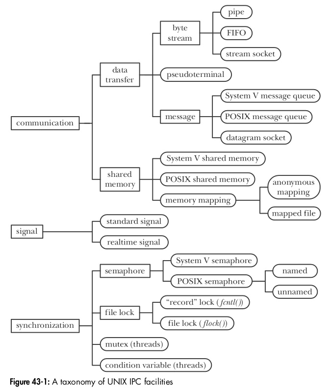

各种IPC工具的标识符和句柄


各种IPC工具的可访问性和持久性

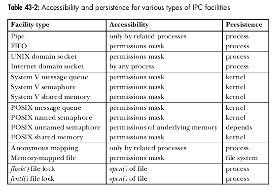


## 20、管道和命名管道（FIFO）

### 管道特征
#### （1）一个管道是一个字节流
从管道中读取数据的进程可以读取任意大小的数据块，而不管写入进程写入管道的数据块的大小是多少。

通过管道传递的数据是顺序的——从管道中读取出来的顺序与它们被写入管道的顺序是完全一样的。

#### （2）管道是单向的
在管道中数据的传递方向是单向的：管道的一端用于写入，另一端则用于读取。

#### （3）从管道中读取数据
试图从一个当前为空的管道中读取数据将会被阻塞直到至少有一个字节被写入到管道中为止。如果管道的写入端被关闭了，那么从管道中读取数据的进程在读完管道中剩余的所有数据之后将会看到文件结束（即 read() 返回0）。

#### （4）可以确保写入不超过 PIPE_BUF 字节的操作是原子的
如果多个进程写入同一个管道，并且它们在一个时刻写入的数据量不超过 PIPE_BUF 字节，那么就可以确保写入的数据不会发生相互混合的情况。

当写入管道的数据块的大小超过了 PIPE_BUF 字节，那么内核可能会将数据分割成几个较小的片段来传输，在读者从管道中消耗数据时再附加上后续的数据。（wirte() 调用会阻塞直到所有数据被写入到管道为止。）当只有一个进程向管道写入数据时（通常的情况），PIPE_BUF 的取值就没有关系了。但如果有多个写入进程，那么大数据块的写入可能会被分解成任意大小的段（可能会小于 PIPE_BUF 字节），并且可能会出现与其他进程写入的数据交叉的现象。

只有在数据被传输到管道的时候，PIPE_BUF 限制才会起作用。当写入的数据达到 PIPE_BUF 字节时，wirte() 会在必要的时候阻塞直到管道中的可用空间足以原子地完成操作。如果写入的数据大于 PIPE_BUF 字节，那么 write() 会尽可能多地传输数据以充满整个管道，然后阻塞直到一些读取进程从管道中移除了数据。如果此类阻塞的 write() 被一个信号处理器中断了，那么这个调用会被解除阻塞并返回成功中传输到管道中的字节数，这个字节数会少于请求写入的字节数（所谓的部分写入）。

#### （5）管道的容量是有限的
管道其实是一个在内核内存中维护的缓冲器，这个缓冲区的存储能力是有限的。一旦管道被填满之后，后续向该管道的写入操作就会被阻塞直到读者从管道中移除了一些数据为止。

一般来讲，一个应用程序无需知道管道的实际存储能力。如果需要防止写者进程阻塞，那么从管道中读取数据的进程应该被设计成以尽可能快的速度从管道中读取数据。

### FIFO
对于 FIFO，在使用 open() 系统调用打开时，应避免使用 O_RDWR 参数。原因有二：

（1）在大多数 UNIX 实现（包括Linux）上，当打开一个 FIFO 时可以通过指定 O_RDWR 标志来绕过打开 FIFO 时的阻塞行为。这样，open() 就会立即返回，但无法使用返回的文件描述符在 FIFO 上读取和写入数据。这种做法破坏了 FIFO 的 I/O 模型，SUSv3 明确指出以 O_RDWR 标志打开一个 FIFO 的结果是未知的，因此出于可移植性的原因，开发人员不应该使用这项技术。

（2）当使用 O_RDWR 参数调用 open() 之后，调用进程在从返回的文件描述符中读取数据时永远都不会看到文件结束，因为永远都至少存在一个文件描述符被打开着以等待数据被写入 FIFO，即进程从中读取数据的那个描述符。

### 边界
管道和 FIFO 中的数据是字节流，消息之间是没有边界的。这意味着当多条消息被传送到一个进程中时，发送者和接收者必须要约定某种规则来分隔消息。这可以使用多种方法：

    (1) 每条消息使用诸如换行符之类的分隔符结束。
    (2) 在每条消息中包含一个大小固定的头，头中包含一个表示消息长度的字段，该字段指定了消息中剩余部分的长度。
    (3) 使用固定长度的消息并让服务器总是读取这个大小固定的消息。

不管使用这三种技术中的哪种，每条消息的总长度必须要小于 `PIPE_BUF` 字节，以防止内核对消息进行拆分而造成与其他写者发送的消息错乱的情况的发生。

### 管道和FIFO在open、write和read等系统调用上的语义


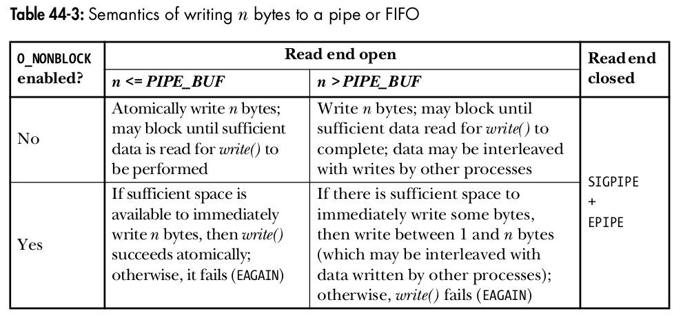


## 21、文件锁
文件锁有以下几种：

    (1) flock() 对整个文件加锁；
    (2) fcntl() 对一个文件区域加锁；
    (3) open(file, O_CREAT | O_EXCL, ...) 和 unlink(file)
    (4) link(file, lockfile) 和 unlink(lockfile)

**注：**

    (1) 前两个是标准API（flock()系统调用源自BSD，fcntl()系统调用源自System V），后两个是老式技术（标准之前的临时技术）。
    (2) 以上四种文件锁都是建议性锁（advisory），不是强制性锁（mandatory）。
    (3) 前两种支持读锁（共享锁）和写锁（互斥锁）。
    (4) 建议使用 fcntl() 系统调用，相对来说，其锁粒度较细。
    (5) 使用锁时，注意死锁。


## 22、TCP协议
### TCP协议状态机
维护一个TCP连接需要同步协调这个连接的两端。为了减小这项任务的复杂度，TCP结点以状态机的方式来建模。

TCP协议状态迁移图

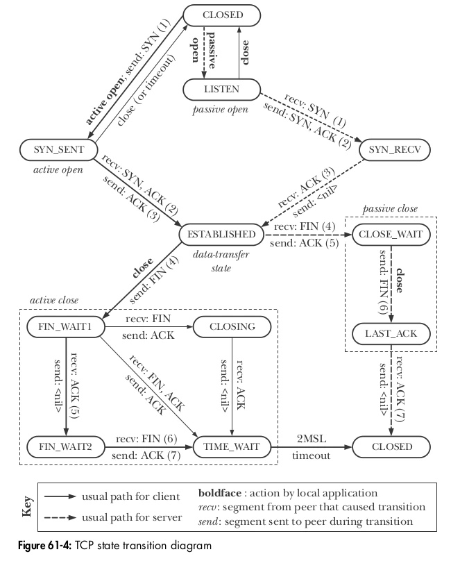

 注：更加详细的状态迁移图请参见：http://www.cl.cam.ac.uk/~pes20/Netsem/poster.pdf 。

### TCP连接的建立
TCP协议的建立连接时须要执行三个步骤，俗称“3次握手”。

    (1) connect() 系统调用导致客户端TCP结点发送一个SYN报文到服务器端TCP结点。
        这个报文将告知服务器有关客户端TCP结点的初始序列号。
    (2) 服务器端TCP结点必须确认客户端发送来的TCP/SYN报文，并告知客户端自己的初始序列号。
        服务器端TCP结点返回一个同时设定了SYN和ACK控制位的报文。
    (3) 客户端TCP结点发送一个ACK报文来确认服务器端TCP结点的SYN报文。

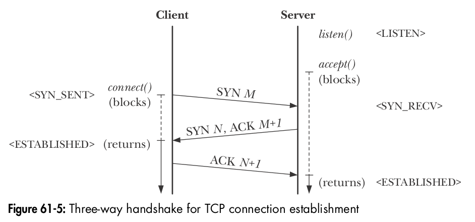

### TCP连接的终止
    (1) 在一个TCP连接中，其中一端的应用程序执行 close() 系统调用（通常由客户端发起）——主动关闭。
    (2) 稍后，连接另一端的应用程序（一般是服务器）也执行一个 close() 系统调用——被动关闭。

#### 具体细节的是
    (1) 客户端执行一个主动关闭，这将导致客户端TCP结点发送一个FIN报文给服务器；
    (2) 在接收到FIN报文后，服务器端TCP结点发出ACK报文作为响应。
        之后在服务器端，任何对read()系统调用的操作都会产生文件结尾（即返回0）。
    (3) 稍后，当服务器关闭自己这端的连接时，服务器端TCP结点发送FIN报文到客户端；
    (4) 客户端TCP结点收到FIN报文后，发送ACK报文作为响应，以此来确认服务器端发来的FIN报文。

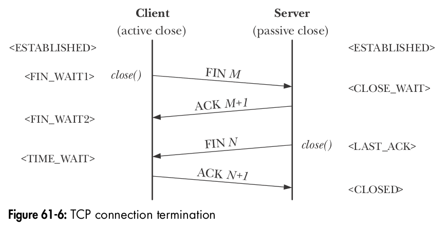

### TCP序列号和确认机制
每个通过TCP连接传递的字节都由TCP协议分配一个逻辑序列号。在一条连接中，双向数据流都有各自的序列号。当传送一个报文时，该报文的序列号字段被设为该传输方向上的报文段数据域第一个字节的逻辑偏移。这样 TCP 接收端就可以按照正确的顺序对接收到的报文段重新组装，并且对接收到的每个报文都发送一个确认报文给发送端来表明自己接收到的是哪一个数据。

要实现可靠的通信，TCP采用了主动确认的方式。也就是，当一个报文段被成功接收后，TCP接收端会发送一个确认消息（即设置了ACK位报文段）给TCP发送端，该消息的确认序列号字段被设置为接收方所期望接收的下一个数据字节的逻辑序列号（换句话说，确认序列号字段的值就是上一个成功接收的数据字节的序列号加1）。

当TCP发送端发送报文时会设置一个定时器。如果在定时器超时前没有接收到确认报文，那么该报文会重新发送。


## 23、SOCKET
### shutdown() 系统调用和 close() 系统调用
`shutdown()` 和 `close()` 都是关闭一个Socket套接字，但它们是有区别的：**`shutdown() 关闭的套接字通道`**（即文件描述 open file description，不是文件描述符 open file descriptor），**`并不关闭由Socket打开的文件描述符`**；而 **`close() 关闭的仅仅是文件描述符`**。因此，**`要想关闭Socket文件描述符，必须调用 close()`**。注：在关闭文件描述符时，如果所有文件描述符对文件描述的引用为0时，系统会自动关闭文件描述。

说明：**`文件描述和文件描述符的区别`**

    (1) 文件描述（file description）
        文件描述表示的是一个打开文件的上下文信息（大小、内容、编码等与文件有关的信息），这部分内容位于内核中并由内核来管理。
    (2) 文件描述符（file descriptor）
        文件描述符是位于用户空间，仅仅是一个整数。其实文件描述符也对应着一个数据结构（属于进程，它是一个列表或数组），
        该数据结构指向内核空间中的一个文件描述，而文件描述符仅是该数据结构的编号（可以认为是下标）。
    (3) 当用户通过类似 open() 的系统调用来打开一个文件描述符时，内核会为用户生成一个新的文件描述，并通过某种途径
        （上面所述的文件描述符对应的数据结构）让文件描述符与文件描述关联起来。
        一般来说，当打开一个文件描述符时，同时也会生成一个新的文件描述；但使用类似 dup() 的系统调用时，也生成一个新的文件
        描述符，但不会生成一个新的文件描述————新生成的文件描述符和原先的文件描述符关联到同一个文件描述，因此，我们会看到，
        如果操作一个文件描述符时（如写入一些数据），另一个文件描述符的文件偏移量（可以通过lseek()系统调用得到）也会跟着改变。
    (4) 如果有多个文件描述符同时关联到同一个文件描述，那么当关闭其中的一个文件描述符时，文件描述不会被关闭；
        只有当最后一个文件描述符（即所有的文件描述符都）被关闭时，文件描述才会被关闭。
    (5) 可以把文件描述比喻为一个抽屉，把文件描述符可以比喻为抽屉的把手（handler之所以翻译成“句柄”就是这个原因）；
        有了这个把手（文件描述符），用户就可以操作抽屉（文件描述）里的内容了。一个抽屉可以有多个把手（即一个文件描述可以对应
        多个文件描述符），只有当所有的把手（文件描述符）都关闭了，内核就知道此时没有用户空间的程序要用这个抽屉（文件描述）了，
        那么就会把它回收。

### socket系统调用
关键的socket系统调用有以下几个：
#### （1）int socket(int domain, int type, int protocol)
创建一个新的socket。

#### （2）int bind(int sockfd, const struct sockaddr *addr, socklen_t addrlen)
将一个socket绑定到一个地址上。通常，服务器需要使用这个调用来将其socket绑定到一个众所周知的地址上使得客户端能够定位到该socket上。

除了将一个服务器的socket绑定到一个众所周知的地址之外，还有其他的做法：对于一个Internet domain socket来讲，服务器可以不调用bind() 而直接调用listen()，这将会导致内核为该socket选择一个临时端口。之后服务器可以使用getsockname()等系统调用来获取socket的地址。在这种场景中，服务器必须要发布其地址，使得客户端能够知道如何定位到服务器的socket。

#### （3）int listen(int sockfd, int backlog)
允许一个流socket接受来自其他socket的接入连接。

backlog参数指定了在服务端调用 accept() 之前，服务器处理未决socket连接的队列容量（即缓存未决socket的个数）。

#### （4）int accept(int sockfd, struct sockaddr *addr, socklen_t *adrlen)
在一个监听流socket上接受来自一个对等应用程序的连接，并可选地返回对等socket的地址。

accept 会创建一个新的socket，并且正是这个新socket与执行connect()的对等socket进行连接。其返回的结果是已经连接的socket的文件描述符。

#### （5）int connect(int sockfd, const struct sockaddr *addr, socklen_t *addrlen)
建立与另一个socket之间的连接。

#### （6）ssize_t recv(int sockfd, void *buffer, size_t length, int flags)

#### （7）ssize_t send(int sockfd, const void *buffer, size_t length, int flags)

#### （8）ssize_t recvfrom(int sockfd, void *buffer, size_t length, int flags, struct sockaddr *src_addr, socklen_t *addrlen)

#### （9）ssize_t sendto(int sockfd, const void *buffer, size_t length, int flags, const struct sockaddr *dest_addr, socklen_t addrlen)

注：以上系统调用 `listen` 和 `accept` 只能用于 `TCP`，`recvfrom` 和 `sendto` 只能用于 `UDP`，其余的可以用于 `TCP` 和 `UDP`。

### TCP相当于电话系统

### UDP相当于邮政系统
#### 在数据报socket上使用connect()
尽管数据报socket是无连接的，但在数据报socket上应用connect()系统调用仍然是起作用的。在数据报socket上调用connect()会导致内核记录这个socket的对等socket的地址。

术语已连接的数据报socket就是指此种socket；术语非连接的数据报socket是指那些没有调用connect() 的数据报socket（即新数据报socket的默认行为）。

当一个数据报socket已连接之后：

    (1) 数据报的发送可在socket上使用write()或send()来完成并且会自动被发送到同样的对等socket上。
    (2) 在这个socket上只能读取由对等socket发送的数据报。

注：connect()的作用对数据报socket是不对等的。上面的论断只适用于调用了connect()数据报socket，并不适用于它连接的远程socket（除非对等应用程序在其socket上也调用了connect()）。

通过再发起一个connect()调用可以修改一个已连接的数据报socket的对等socket。此外，通过指定一个地址族（如UNIX Domain中的sun_family）为AF_UNSPIC的地址结构还可以解除对等关联关系。


## 24、内核空间锁
##### （1）原子操作
每个操作都原子的，中间不会被中断。

##### （2）自旋锁
这是最常用的锁。它们用于短期保护某段代码，以防止其他处理器的访问。在内核等待自旋锁释放时，会重复检查是否能获取锁，而不会进入睡眠状态（忙等待）。当然，如果等待时间较长，则效率显然不高。

##### （3）信号量
用经典方法实现的。在等待信号量释放时，内核进入睡眠状态，直到被唤醒。唤醒后，内核再次重新尝试获取信号量。互斥量是信号量的特例，互斥量保护的临界区，每次只能有一个用户进入。

##### （4）读者/写者锁
这些锁会区分对数据结构的两种不同类型的访问。任意数目的处理器都可以对数据结构进行并发读访问，但只有一个处理器能进行写访问。事实上，在进行写访问时，读访问是无法进行的。

### 自旋锁
自旋锁的获取操作被定义为一个原子操作，在获得自旋锁的情况下可以防止竞态条件出现。

    (1) 自旋锁决不应该长期持有，因为所有等待锁释放的处理器都处于不可用状态，无法用于其他工作。
    (2) 被自旋锁保护的代码（包括所调用的函数）不会也不应该进入睡眠，即被保护的代码（包括子例程）在任何时候都不能发生睡眠）。
    (3) 自旋锁当前的持有者无法多次获得同一自旋锁，因为这会发生死锁。
    (4) 在多处理器环境下，保护数据；在单处理器环境下，起到禁止抢占的作用，即非抢占式内核。

注：被自旋锁锁住的进程一直旋转（其实是一直反复执行一条指令）。

Documentation/spinlocks.txt中记录了如何使用自旋锁的建议。

### 信号量
和自旋锁相似，不同之处就是，不能获取信号量的进程不是在旋转，而是进入睡眠状态。

### 自旋锁与信号量的区别
    (1) 自旋锁适合保护较短的临界区，信号量适合于保护更长的临界区以防止并行访问。
        但信号量不应该用于保护较短的代码范围，因为竞争信号量时需要使进程睡眠和再次唤醒，代价很高。
    (2) 因获取信号量而睡眠的进程，其状态被置为TASK_UNINTERRUPTIBLE（不可中断）状态，在等待进入临界区的过程中，
        无法接收信号。如果信号量没有分配，则该进程可以立即获得信号量并进入到临界区，而不会进入睡眠。
    (3) 信号量不能用在中断处理函数和 tasklet 等不可睡眠的场景。
        深层次的原因是，Linux内核以进程为单位调度（理论上应该是线程，但Linux中的线程被实作成进程——这种进程相当廉价），
        如果在中断上下文睡眠，中断将不能被正确处理。
    (4) 可睡眠的场景既可以使用内核信号量，也可以使用自旋锁。

### RCU（read-copy-update）机制
RCU是Linux新增的一种锁机制。RCU的性能很好，但对内存有一定的开销。

#### RCU的潜在约束
    (1) 对共享资源的访问在大部分时间应该是只读的，写访问应该相对很少。
    (2) 在RCU保护的代码范围内，内核不能进入睡眠状态（和自旋锁要求一样）。
    (3) 受保护资源必须通过指针访问。

#### RCU原理
该机制记录了指向共享数据结构的指针的所有使用者。在该结构将要改变时，则首先创建一个副本，在副本中修改。在所有进行读访问的使用者结束对旧副本的读取之后，指针可以替换为指向新的、修改后副本的指针。注意，这种机制允许读写并行进行。

#### 核心API
假定指针ptr指向一个被RCU保护的数据结构。直接反引用指针是被禁止的。首先必须调用`rcu_dereference(ptr)`，然后反引用返回的结果。此外，反引用指针并使用其结果的代码，需要用`rcu_read_lock`和`rcu_read_unlock`调用保护起来。如：
```c
rcu_read_lock();
p = rcu_dereference(ptr);
if (p!=NULL) {
    awesome_function(p);
}
rcu_read_unlock();
```
被反引用的指针不能在被 `rcu_read_lock()` 和 `rcu_read_unlock()` 保护的代码范围之外使用，也不能用于写访问。

如果必须修改prt指向的对象，则需要使用 rcu_assign_pointer 函数：
```c
struct super_duper *new_ptr = kmalloc(...);
new_ptr->meaning = xyz;
new_ptr->of = 42;
new_ptr->life = 23;
rcu_assign_pointer(ptr, new_ptr);
```

如果更新可能来自内核中许多地方，那么必须使用普通的同步原语（如自旋锁）防止并发的写操作。尽管RCU能保护读访问不受写访问的干扰，但它不对写访问之间的相互干扰提供保护。

其它的请参见 Documentation/RCU/ 目录下的文档。


## 25、中断
在中断上下文中运行，不能访问虚拟地址空间中的用户空间部分。


## 26、内核线程
在某种程度上，内核线程和用户进程相差无几。**`内核线程是独立运行于内核空间的标准进程`**；粗略地讲，可以把内核线程看成是用户进程。

内核线程和普通进程间的区别在于内核线程没有独立的地址空间（实际上指向地址空间的mm指针被设置为NULL），因此，**`内核线程不与任何特定的用户空间进程相关联，因此也无权处理用户空间。内核线程只在内核空间运行，从来不切换到用户空间中`**。内核线程和普通进程一样，可以被调度，也可以被抢占。

通常在发生系统调用时，内核会代表用户空间的进程运行，此时它才能访问用户空间的地址，也只有在此时，它才会映射用户空间的内存。**`内核在执行系统调用时处于进程上下文`**，current指针指向当前任务，即引发系统调用的那个进程。在进程上下文中，内核可以休眠（能够休眠说明系统调用可以使用内核提供的绝大部分功能），并且也可以被抢占。当系统调用返回时，控制权仍然在system_call()函数中，它最终会负责切换到用户空间，并让用户空间继续执行下去。

内核线程的使用是廉价的，唯一使用的资源就是内核栈和上下文切换时保存寄存器的空间。支持多线程的内核叫多线程内核（Multi-Threads Kernel）。

**`内核线程只能由其他内核线程创建`**。内核是通过从kthreadd内核线程衍生出其它所有新的内核线程（因为由kthreadd创建出来的内核线程只能看到内核地址空间，看不到用户地址空间）。`kthread_create()`函数创建内核线程时，会向kthreadd内核线程发出请求，并等待kthreadd内核线程创建完成，然后将kthreadd内核线程创建好的task_struct结构体（新创建的内核线程）返回给`kthread_create()`的调用者。因此，在内核空间的任何地方，如果想创建一个内核线程，只需要调用`kthread_create()`函数即可。

内核线程启动后就一直运行，直到调用`do_exit()`函数退出，或者内核的其他部分调用`kthread_stop()`函数退出；传递给`kthread_stop()`函数的参数为`kthread_create()`函数返回的task_struct结构体的地址。


## 27、内核定时器
**`内核定时器是在时钟中断发生后，作为软中断在中断下半部的上下文中执行的`**。所有的定时器结构都以链表的形式存储。时钟中断发生后，内核按链表顺序依次执行。一般来说，定时器在超时后会立即执行，但是也有可能被推迟到下一个时钟周期才能运行，所以不能用定时器来实现硬实时的操作。又因为内核定时器发生在软中断中，因此，定时器执行函数不能够睡眠，也不能够持有信号量。

内核定时器注册的处理函数只执行一次——不能循环执行。定时器并不周期运行，它在超时后就自动撤销。动态定时器不断地创建和撤销，而且它的运行次数也不受限制。

硬件为内核提供了一个系统定时器来计算流逝的时间。

定时器使用样例：
```c
/********************************************************/
// 内核定时器例子

#include <linux/init.h>
#include <linux/module.h>
#include <linux/timer.h>
#include <linux/fs.h>

#define TIMER_MAJOR     234
#define DEVICE_NAME     "timer_test"

// 第一步：定义timer结构
struct timer_list timer;

static void func_timer(unsigned long data)
{
    // 第四步：修改定时器的超时参数并重启
    mod_timer(&timer, jiffies + HZ);    // mod_timer函数结束时会自动重启定时器
    printk("current jiffies is %ld\n", jiffies);
}

struct file_operations timer_ops = {
    .owner = THIS_MODULE,
};

static int __init timer_init(void)
{
    register_chrdev(TIMER_MAJOR, DEVICE_NAME, &timer_ops);

    // 第二步：初始化定时器
    setup_timer(&timer, func_timer, 0);
    #if 0
    init_timer(&timer);
    timer.data = 0;
    timer.expires = jiffies + HZ;
    timer.function = func_timer;
    #endif

    // 第三步：添加激活计时器
    add_timer(&timer);

    printk("timer_init\n");
    return 0;
}

static void __exit timer_exit(void)
{
    // 第五步：删除定时器
    //del_timer(&timer);
    del_timer_sync(&timer);
    unregister_chrdev(TIMER_MAJOR, DEVICE_NAME);
}

module_init(timer_init);
module_exit(timer_exit);
MODULE_DESCRIPTION("Test Kernel Timer");
MODULE_LICENSE("GPL");
MODULE_AUTHOR("xgfone <xgfone@126.com>");

/********************************************************/
// # insmod timer_test.ko
// timer_init
// timer_init
// current jiffies is 220614
// current jiffies is 220614
// current jiffies is 220714
// current jiffies is 220714
```


## 28、sk_buff

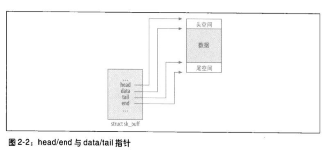

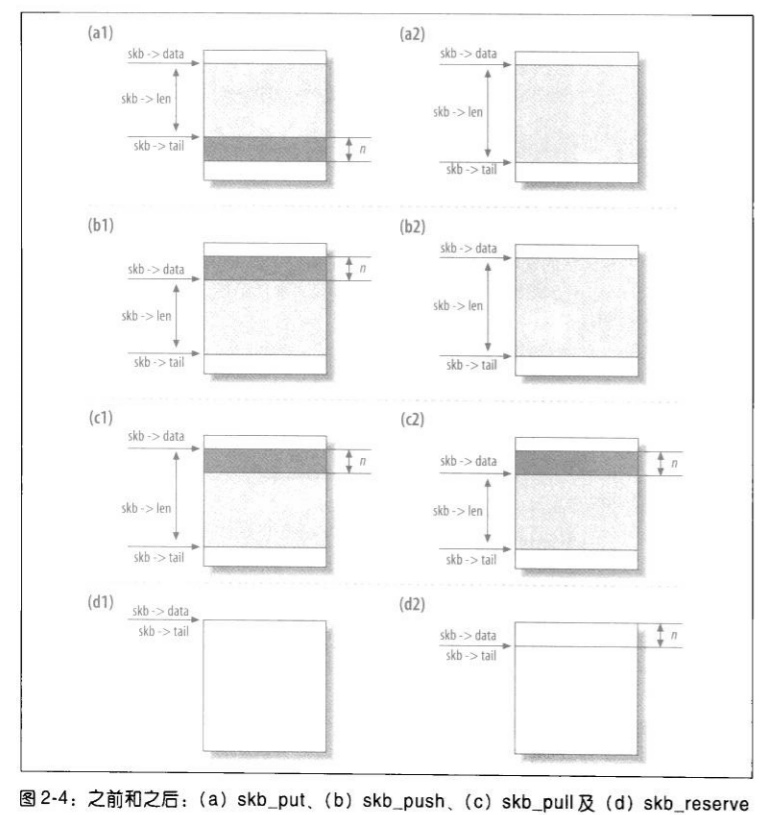

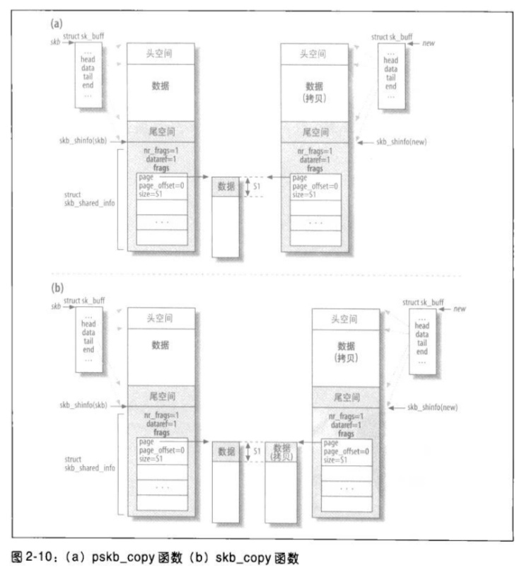


## 29、内存分配
Linux中有两种内存分配策略：`伙伴系统`和`slab系统`。

伙伴系统是最低层的内存管理机制，提供页式的内存管理。slab系统是位于伙伴系统之上的内存管理机制，提供基于对象的内存管理。

### alloc_pages 和 page_address
分配页，得到一个页地址，申请的内存以页为单位，至少是一个页。而且其返回值不能直接使用，需要 `page_address` 来获得其内存地址。

### __get_free_pages
该函数是对 `alloc_pages` 和 `page_address` 的封装。

### kmem_cache_create、kmem_cache_alloc  和 kmem_cache_free
要从SLAB中申请内存，需要创建一个SLAB对象（`kmem_cache_create`），然后通过 `kmem_cache_alloc` 和 `kmem_cache_free` 来申请和释放内存。

### kmalloc
该函数也是SLBA提供的对象管理接口，只不过内核已经构建了一些固定大小的对象，用户通过 `kmalloc` 申请时，就使用了这些对象。`kmalloc` 分配的物理地址都是连续的，如果没有连续的物理地址空间可用，则分配失败。

### vmalloc
该函数的功能同 `kmalloc`，不同之处是，它把物理地址不连续的内存页拼凑为逻辑地址连续的内存空间。如果不在意性能的话，使用 `vmalloc` 函数是个不错的选择。
