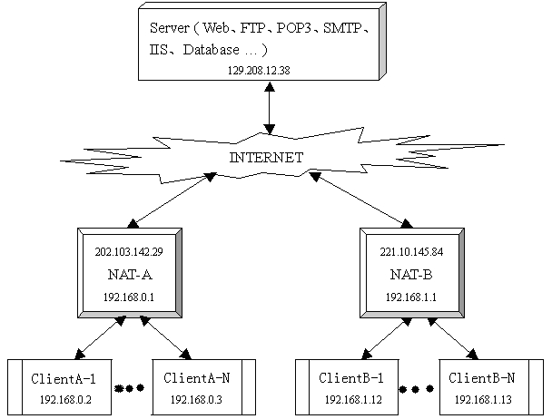
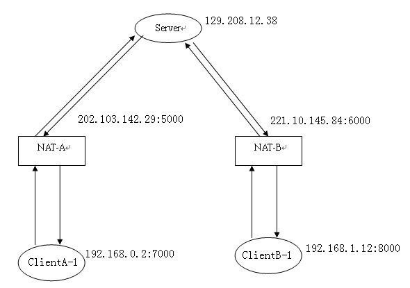

P2P，UDP和TCP穿透NAT
====================

## 1 NAT简介

NAT(Network Address Translation，网络地址转换)是一种广泛应用的解决IP短缺的有效方法， NAT将内网地址转和端口号换成合法的公网地址和端口号，建立一个会话，与公网主机进行通信。

### 1.1 NAT分类

NAT从表面上看有三种类型：`静态NAT`、`动态地址NAT`、`地址端口转换NAPT`。　　

##### 静态NAT
静态地址转换将内部私网地址与合法公网地址进行一对一的转换，且每个内部地址的转换都是确定的。

##### 动态NAT
动态地址转换也是将内部本地地址与内部合法地址一对一的转换，但是动态地址转换是从合法地址池中动态选择一个未使用的地址来对内部私有地址进行转换。

##### NAPT
它也是一种动态转换，而且多个内部地址被转换成同一个合法公网地址，使用不同的端口号来区分不同的主机，不同的进程。

从实现的技术角度，又可以将 NAT 分成如下几类：`全锥NAT(Full Cone NAT)`、`限制性锥NAT(Restricted Cone NAT)`、`端口限制性锥NAT(Port Restricted Cone NAT)`、`对称NAT(Symmetric NAT)`。

##### 全锥NAT
全锥NAT把所有来自相同内部IP地址和端口的请求映射到相同的外部IP地址和端口。任何一个外部主机均可通过该映射发送数据包到该内部主机。

全锥型NAT在内网用户A(Private Endpoint)首次向外部主机发送数据包时创建地址映射会话，并为A分配一个公网地址和端口(Public Endpoint)，以后任何A向外部发送的数据都将使用这个Public Endpoint。此后，任何外部主机想要与A通信，只要将数据包发送到Public Endpoint上，A就能够顺利的进行接收。

##### 限制性锥NAT
限制性锥NAT把所有来自相同内部IP地址和端口的请求映射到相同的外部IP地址和端口。但是，和全锥NAT不同的是：只有当内部主机先给外部主机发送数据包，该外部主机才能向该内部主机发送数据包。

限制锥型NAT在内网用户A(Private Endpoint)首次向外部主机发送数据包时创建地址映射会话，并为A分配一个公网地址和端口(Public Endpoint)，以后任何A向外部发送的数据包都将使用这个Public Endpoint。此后，如果某个外部主机（Endpoint IP:PORT）想要与A通信，只要将数据包发送到Public Endpoint并且保证A曾用当前与NAT的会话向该外部主机的IP地址发送过数据，A就能够正常收到外部主机（Endpoint IP:PORT）发送来的数据包

##### 端口限制性锥NAT
端口限制性锥NAT与限制性锥NAT类似，只是多了端口号的限制，即只有内部主机先向外部地址：端口号对发送数据包，该外部主机才能使用特定的端口号向内部主机发送数据包。

端口限制锥型在内网用户A(Private Endpoint)首次向外部主机发送数据包时创建地址映射会话，并为A分配一个公网地址和端口(Public Endpoint)，以后任何A向外部发送的数据都将使用这个Public Endpoint。此后，如果某个外部主机（Endpoint IP:PORT）想要与A通信，只要将数据包发送到Public Endpoint并且保证A曾用当前与NAT的会话向该外部主机的Endpoint发送过数据，A就能够正常收到外部主机（Endpoint IP:PORT）发送来的数据包。

##### 对称NAT
对称NAT与上述3种类型都不同, 不管是全锥NAT，限制性锥NAT还是端口限制性锥NAT，它们都属于锥NAT（Cone NAT）。当同一内部主机使用相同的端口与不同地址的外部主机进行通信时，对称NAT会重新建立一个Session，为这个Session分配不同的端口号，或许还会改变IP地址。

对称型NAT是一种比较特殊的NAT。内网用户A(Private Endpoint)首次向外部主机S1发送数据包时创建地址映射会话Session1，并为A分配一个公网地址和端口(Public Endpoint1)，以后A所有发向S1的数据包都使用这个Public Endpoint1。如果之后A用同一个Socket向外部主机S2发送数据包，这时对称型NAT又为其分配一个地址映射会话，并为A分配一个新的公网地址和端口对（Public Endpoint2），以后A所有发向S2的数据包都使用这个Public Endpoint2。对称型NAT规定Public Endpoint1和Public Endpoint2一定不相同。此外，如果任何外部主机想要发送数据给A，那么它首先应该收到A发给他的数据，然后才能往回发送，否则即使他知道内网主机的Public Endpoint也不能发送数据给A。这种NAT可以通过端口猜测等方法进行穿透，但是效果并不是很好，很难实现UDP-P2P通信。

### 1.2 NAT的作用
NAT不仅实现地址转换，同时还起到防火墙的作用，隐藏内部网络的拓扑结构，保护内部主机。NAT不仅完美地解决了 IP 地址不足的问题，而且还能够有效地避免来自网络外部的攻击，隐藏并保护网络内部的计算机。这样对于外部主机来说，内部主机是不可见的。但是，对于P2P应用来说，却要求能够建立端到端的连接，所以如何穿透NAT也是P2P技术中的一个关键。

## 2 P2P穿透NAT
要让处于NAT设备之后的拥有私有IP地址的主机之间建立P2P连接，就必须想办法穿透NAT，现在常用的传输层协议主要有TCP和UDP，下面就是用这两种协议来介绍穿透NAT的策略。

### 2.1 网络拓扑结构

下面假设有下图所示网络拓扑结构图。

Server（129.208.12.38）是公网上的服务器，NAT-A和NAT-B是两个NAT设备（可能是集成NAT功能的路由器，防火墙等），它们具有若干个合法公网IP，在NAT-A阻隔的私有网络中有若干台主机【ClientA-1，ClientA-N】，在NAT-B阻隔的私有网络中也有若干台主机【ClientB-1，ClientB-N】。为了以后说明问题方便，只讨论主机ClientA-1和ClientB-1。

假设主机ClientA-1和主机ClientB-1都和服务器Server建立了“连接”，如图2 所示。

由于NAT的透明性，所以ClientA-1和ClientB-1不用关心和Server通信的过程，它们只需要知道Server开放服务的地址和端口号即可。根据图1，假设在ClientA-1中有进程使用socket（192.168.0.2：7000）和Server通信，在ClientB-1中有进程使用socket（192.168.1.12:8000）和Server通信。它们通过各自的NAT转换后分别变成了socket（202.103.142.29：5000）和socket（221.10.145.84：6000）。

### 2.2 使用UDP穿透NAT

通常情况下，当进程使用UDP和外部主机通信时，NAT会建立一个Session，这个Session能够保留多久并没有标准，或许几秒，几分钟，几个小时。假设ClientA-1在应用程序中看到了ClientB-1在线，并且想和ClientB-1通信，一种办法是Server作为中间人，负责转发ClientA-1和ClientB-1之间的消息，但是这样服务器太累，会吃不消。另一种方法就是让ClientA-1何ClientB-1建立端到端的连接，然后他们自己通信。这也就是P2P连接。根据不同类型的NAT，下面分别讲解。

#### 全锥NAT
穿透全锥型NAT很容易，根本称不上穿透，因为全锥型NAT将内部主机的映射到确定的地址，不会阻止从外部发送的连接请求，所以可以不用任何辅助手段就可以建立连接。

#### 限制性锥NAT和端口限制性锥NAT（简称限制性NAT）
穿透限制性锥NAT会丢弃它未知的源地址发向内部主机的数据包。所以如果现在ClientA-1直接发送UDP数据包到ClientB-1，那么数据包将会被NAT-B无情的丢弃。所以采用下面的方法来建立ClientA-1和ClientB-1之间的通信。

1. ClientA-1（202.103.142.29:5000）发送数据包给Server，请求和ClientB-1（221.10.145.84:6000）通信。
2. Server将ClientA-1的地址和端口（202.103.142.29:5000）发送给ClientB-1，告诉ClientB-1，ClientA-1想和它通信。
3. ClientB-1向ClientA-1（202.103.142.29:5000）发送UDP数据包，当然这个包在到达NAT-A的时候，还是会被丢弃，这并不是关键的，因为发送这个UDP包只是为了让NAT-B记住这次通信的 目的地址:端口号，当下次以这个地址和端口为源的数据到达的时候就不会被NAT-B丢弃，这样就在NAT-B上打了一个从ClientB-1到ClientA-1的孔。
4. 为了让ClientA-1知道什么时候才可以向ClientB-1发送数据，所以ClientB-1在向ClientA-1（202.103.142.29:5000）打孔之后还要向Server发送一个消息，告诉Server它已经准备好了。
5. Server发送一个消息给ClientA-1，内容为：ClientB-1已经准备好了，你可以向ClientB-1发送消息了。
6. ClientA-1向ClientB-1发送UDP数据包。这个数据包不会被NAT-B丢弃，以后ClientB-1向ClientA-1 发送的数据包也不会被ClientA-1丢弃，因为NAT-A已经知道是ClientA-1首先发起的通信。至此，ClientA-1和ClientB-1就可以进行通信了。

### 2.3 使用TCP穿透NAT

使用TCP协议穿透NAT的方式和使用UDP协议穿透NAT的方式几乎一样，没有什么本质上的区别，只是将无连接的UDP变成了面向连接的TCP 。值得注意是：

1. ClientB-1在向ClientA-1打孔时，发送的SYN数据包，而且同样会被NAT-A丢弃。同时，ClientB-1需要在原来的socket上监听，由于重用socket，所以需要将socket属性设置为SO_REUSEADDR。

2. ClientA-1向ClientB-1发送连接请求。同样，由于ClientB-1到ClientA-1方向的孔已经打好，所以连接会成功，经过 3 次握手后，ClientA-1到ClientB-1之间的连接就建立起来了。

### 2.4 穿透对称NAT

上面讨论的都是怎样穿透锥（Cone）NAT，对称NAT和锥NAT很不一样。对于对称NAT，当一个私网内主机和外部多个不同主机通信时，对称NAT并不会像锥（Cone，全锥，限制性锥，端口限制性锥）NAT那样分配同一个端口。而是会新建立一个Session，重新分配一个端口。参考上面穿透限制性锥NAT的过程，在 步骤3 时：ClientB-1（221.10.145.84:?）向ClientA-1打孔的时候，对称NAT将给ClientB-1重新分配一个端口号，而这个端口号对于Server、ClientB-1、ClientA-1来说都是未知的。同样，ClientA-1根本不会收到这个消息，同时在步骤4，ClientB-1发送给Server的通知消息中，ClientB-1的socket依旧是（221.10.145.84:6000）。而且，在 步骤6 时：ClientA-1向它所知道但错误的ClientB-1发送数据包时，NAT-1也会重新给ClientA-1分配端口号。所以，穿透对称NAT的机会很小。下面是两种有可能穿透对称NAT的策略。

#### 2.4.1 同时开放TCP(Simultaneous TCP open)策略

如果一个 对称NAT 接收到一个来自本地私有网络外面的 TCP SYN 包， 这个包想发起一个“引入”的TCP连接，一般来说，NAT会拒绝这个连接请求并扔掉这个SYN包，或者回送一个TCP RST（connection reset，重建连接）包给请求方。但是，有一种情况却会接受这个“引入”连接。

RFC规定：对于对称NAT，当这个接收到的 SYN包中的 `源IP地址:端口`、`目标IP地址:端口` 都与NAT登记的一个已经激活的 TCP 会 话中的地址信息相符时，NAT将会放行这个SYN包。需要特别指出的是：怎样才是一个已经激活的TCP连接？除了真正已经建立完成的TCP连接外，RFC规范指出：如果NAT恰好看到一个刚刚发送出去的一个SYN包和随之接收到的SYN包中的地址：端口信息相符合的话，那么NAT将会认为这个TCP连接已经被激活，并将允许这个方向的SYN包进入NAT内部。同时开放TCP策略就是利用这个时机来建立连接的。

如果ClientA-1和ClientB-1能够彼此正确的预知对方的NAT将会给下一个TCP连接分配的公网TCP端口，并且两个客户端能够同时地发起一个面向对方的“外出”的TCP连接请求，并在对方的SYN包到达之前，自己刚发送出去的SYN包都能顺利的穿过自己的NAT的话，一条端对端的TCP连接就能成功地建立了 。

#### 2.4.2 UDP端口猜测策略

同时开放TCP策略非常依赖于猜测对方的下一个端口，而且强烈依赖于发送连接请求的时机，而且还有网络的不确定性，所以能够建立的机会很小，即使Server充当同步时钟的角色。下面是一种通过UDP穿透的方法，由于UDP不需要建立连接，所以也就不需要考虑“同时开放”的问题。
为了介绍ClientB-1的诡计，先介绍一下STUN协议。STUN（Simple Traversal of UDP Through NATs）协议是一个轻量级协议，用来探测被NAT映射后的`地址:端口`。STUN采用C/S结构，需要探测自己被NAT转换后的`地址:端口`的Client向Server发送请求，Server返回Client转换后的`地址:端口`。

当ClientB-1收到Server发送给它的消息后，ClientB-1即打开 3 个socket。socket-0 向 STUN Server 发送请求，收到回复后，假设得知它被转换后的地址:端口（221.10.145.84:600 5），socket-1向ClientA-1发送一个UDP包，socket-2再次向另一个STUN Server发送请求，假设得到它被转换后的地址:端口（221.10.145.84:60 20）。通常，对称NAT分配端口有两种策略，一种是按顺序增加，一种是随机分配。如果这里对称NAT使用顺序增加策略，那么，ClientB-1将两次收到的地址:端口发送给Server后，Server就可以通知ClientA-1在这个端口范围内猜测刚才ClientB-1发送给它的socket-1中被NAT映射后的地址:端口，ClientA-1很有可能在孔有效期内成功猜测到端口号，从而和ClientB-1成功通信。

#### 2.4.3 问题总结
从上面两种穿透对称NAT的方法来看，都建立在了严格的假设条件下。但是现实中多数的NAT都是锥NAT，因为资源毕竟很重要，反观对称NAT，由于太不节约端口号所以相对来说成本较高。所以，不管是穿透锥NAT，还是对称NAT，现实中都是可以办到的。除非对称NAT真的使用随机算法来分配可用的端口。

## 3 NAT类型的检测

### 前提条件
一个提供两个公网地址（通信地址分别设为：Endpoint1与Endpoint2）的服务器S进行UDP端口数据监听并根据客户的要求给出响应；待检测的用户可以正常进行UDP通信。

### 步骤

1. **检测主机是否位于NAT后**

	为了检测IP地址是不是公网地址，主机A首先发送任意一个UDP数据包给服务器S（Endpoint1），
	S收到包之后，用Endpoint1将接收到数据包头的IP地址和端口打成一个UDP反馈包发送给用户A。
	A在收到反馈包之后，比较自身的Endpoint和反馈包中的Endpoint，如果一样则说明A不位于任何NAT之后，
	否则，就是位于NAT之后，这里并不能判断NAT的具体属于哪一种类型。

2. **检测NAT是否是完全锥型**

	为了检测所处的NAT是否是完全锥型的，主机A向服务器S（Endpoint1）发送UDP数据包后，
	服务器用Endpoint2将接收到数据包头的IP地址和端口打成一个UDP反馈包发送给用户A。另外，
	A在发送UDP数据包后，立即开始端口侦听，设定一个等待时间上限，防止无限堵塞（因为接收是一个While循环）。
	这样进行若干次，如果A每次都没有收到数据包，说明A所处的NAT类型不是完全锥型的；相反，
	在这整个过程中只要收到一次服务的包，就说明A所处的NAT类型是完全限制型的。

3. **检测NAT是否是对称型**

	为了检测所处的NAT是否是对称型的，主机A向服务器S（Endpoint1）发送UDP数据包，服务器S（Endpoint1）
	在收到数据包后，用Endpoint1将接收到数据包头的IP地址和端口打成一个UDP反馈包发送给用户A。另外，
	A在发送数据包后，开始侦听端口并接收数据，设定一个等待时间上限，防止无限堵塞（因为接收是一个While循环）。
	与此同时，主机A用同一个套接字向服务器S （Endpoint2）发送UDP数据，Endpoint2发送与上面类似的UDP回馈包。
	在A的整个数据接收过程中，如果收到的服务器反馈数据包中标识自身的IP地址和端口存在不相同的情况，
	就说明NAT是对称型的，否则就不是。

4. **检测NAT是限制锥型的还是端口限制锥型**

	最后，为了检测所处的NAT是限制锥型的还是端口限制锥型的，主机A向服务S的Endpoint1发送UDP数据包，
	服务器用与Endpoint1相同的IP地址和不同的端号将带有A的Public Endpoint的UDP反馈包发送给A。
	另外，A在发送数据包后，立即侦听端口和并进行数据接收，设定一个等待时间上限，防止无限堵塞
	（因为接收是一个While循环）。重复若干次。如过在整个过程中，用户A收到S发来的数据包，
	就说明NAT是限制型的；否则就说明NAT是端口限制型的。

