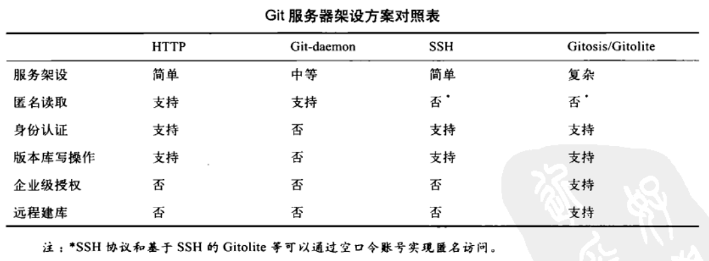

Git服务器架设
===========

Copyright © 2014 - 2016  xgfone(三界). All Rights Reserved.

- **[前言](./build-git-server.md#前言)**
- **[使用 HTTP 协议](./build-git-server.md#使用http协议)**
- **[使用 Git 协议](./build-git-server.md#使用git协议)**
- **[使用 SSH 协议](./build-git-server.md#使用ssh协议)**
- **[Gitolite服务器架设](./build-git-server.md#gitolite服务器架设)**
- **[Gitosis服务器架设](./build-git-server.md#gitosis服务器架设)**

## 前言

跟着教程（网上的教程和`《Git权威指南》`）架设Git版本库服务器，大半个星期过去了，总是出现 Not Found。在这些教程中，不是说在这个文件中写点什么配置，就是在那个文件再写点什么配置，然后。。。。。。就没有了；而且还没有环境说明（因为不同的Linux发行版在某些细节上是不一样的）。没办法，只好去国外看看人家老外怎么说的，结果还真找到问题的解决办法了。

根据国人写的教程，本人没能跟着做出来，不是国人写人的不好或不对，可能是本人太愚钝了，还没开化，跟不上贤人们的步伐。

Git 支持多种协议：`HTTP`、`SSH`、`Git` 以及 `file`。由于 file 本地协议（即`file://`）只能用于本机，下文就不再讲述。

注：`Gitolite` 服务器和 `Gitosis` 服务器是基于 `SSH` 协议。

上述几种协议的优缺点及架设方案如下图（从`《Git权威指南》`一书中截得）：



**本文所使用的环境：**

    OS      : Ubuntu 13.04 64 位
    Apache2 : Apache/2.4.6
    Gitweb  : Gitweb/1.8.3.2-1
    Git     : Git/1.8.3.2-1

_**注：**_

（1）以下介绍的配置都是经过实验成功的；如果你按照下面的方式配置时不成功，可能是你的环境与此环境不一致。

（2）以下配置中，如果有配置文件要修改，就需要重启相关的服务，比如：Apache。下文的介绍中不再一一叙述。


## 使用HTTP协议

### 1、软件包安装
需要安装以下三个软件包：

    (1) git:  Git版本控制系统，既然是 Git 版本库肯定得需要它了；如果你的 Linux 发行版比较旧，其名字可能是 git-core。
    (2) apache2:  这里使用 apache 作为前端；如果你使用的是 RedHat/CentOS，其名字可能是 httpd。
    (3) gitweb（可选）:  用于在 Web 页面上显示 Git 版本库信息（如果你需要这种功能的话）。

执行如下命令：
```shell
$ sudo apt-get install git gitweb apache2
```

**注：**

(1)如果提示没有 `git`，请使用 `git-core`；如果提示没有 `apache2`，可能你在使用 `RedHat/CentOS`，请使用 `httpd`。

(2)如果你使用的是 `RedHat/CentOS`，关于 `Apache` 的全局配置和虚拟主机配置与 `Debian/Ubuntu` 的不同，因此与下文的介绍不同，下文的介绍仅作参考。

**提前说明：**

如果你使用的是 `RedHat/CentOS`，下面的 `git.conf` 和 `gitweb.conf` 两个文件不是 `/etc/apache2/conf-enabled` 目录中，而是放在 `/etc/httpd/conf.d` 目录中。以下均按 `Ubuntu` 系统中的目录结构来说明，不再说明 `RedHat/CentOS`。

### 2、创建 Git 版本库
作为 Git 版本库服务器，一般是裸版本库（即不带工作区的版本库），并且其名字一般以 `.git` 结尾。之所以是裸版本库，是因为 `git push 命令不允许向一个带工作区的版本库推送更新，它只能向裸版本库推送`。

命令格式： `git init --bare --shared [/path/to/repo-name]`

如果指定了 `/path/to/repo-name`，Git 就会在给出的路径名中创建版本库，路径名可以不是绝对路径，此时其路径是相对于当前目录；如果省略版本库路径名，则相当于在当前目录下创建裸版本库，即当前目录为裸版本库的根目录。

在此我们执行：`$ mkdir /tmp/git && git init --bare --shared /tmp/git/myproj.git`

注：我们使用 `/tmp/git` 目录作为 Git 版本库仓库，即我们在 `/tmp/git` 目录下放置所有的 Git 版本库。

至此，版本库 `myproj.git` 创建完毕。

**注意：**因为我们的 `myproj.git` 目录原先并不存在（可以理解为空目录），所以 `myproj.git` 版本库中还没有任何提交对象。

### 3、HTTP 协议传输配置
HTTP 协议传输分为两种：`哑传输` 和 `智能传输`。

`哑传输`是指 Git 版本库的传输使用的是 HTTP 服务器静态文件传输，它对 Git 版本库中信息一无所知；因此，我们也能想像到其性能之低下。

`智能传输`是 HTTP 服务器使用了 Git 的 CGI 后端程序，它能知道 Git 版本库的一切信息，能增量传输及显示传输进度。相对于哑传输，其性能比较高。

智能传输的配置比哑传输的配置简单的多，再加上哑传输性能很差（尤其版本库比较大时，每次都会把整个版本库传送一遍），因此，本文不讲述哑传输，如果读者想配置，可以参考《Git权威指南》第27章。

如果要配置智能传输，Git 的版本不能低于 `1.6.6`，因为 HTTP 智能传输使用了 `git-http-backend` 后端——Git 1.6.7 版本及其后续版本才提供。另外，**`Apache 必须是 2.X 版本，不能是 1.X 版本`**。

Git 版本库服务使用 HTTP 协议时，其授权模式使用的是 HTTP 服务器（比如：Apache）的授权方式。

#### （1）只读配置
在配置只读服务（包括哑传输和智能传输）时，按照蒋大官人的介绍，我一个也没有配置成功过，总是出现 403 错误（无权限）；一旦加上权限设置时，就没问题了，可以访问了，但要输入账号和密码。

因此，关于这一节的配置，本人无法给出介绍。

#### （2）读写授权
在 `/etc/apache2/conf-enabled` 目录新建一个新文件，名字可以随便起，但必须以 `.conf` 结尾（这里假设为 git.conf）；然后将下面的配置选项写入该文件中。
```
SetEnv GIT_PROJECT_ROOT /tmp/git   # Git 版本库仓库
SetEnv GIT_HTTP_EXPORT_ALL         # 有这句，就不用在每个版本库中都创建一个 git-daemon-export-ok 文件
ScriptAlias /git/ /usr/lib/git-core/git-http-backend/  # 使用Git所提供的后端
<Location  "/git/">
        AuthType  Basic
        AuthName  "Git Repos"
        AuthUserFile  /tmp/git.passwd   # Apache 务器密码文件，用于授权，可以换成其他的授权文件
        Require  valid-user
</Location>
```

然后，还要创建一个 `/tmp/git.passwd` 密码文件，这个文件是使用 `htpasswd` 程序生成的。如果系统中没有 `htpasswd` 程序，需要安装 `apache2-utils` 软件包（htpasswd 位于该软件包）： `$ sudo apt-get install apache2-utils`

##### htpasswd 的语法
```
$ htpasswd [-cimBdpsDv] [-C cost] passwordfile username
$ htpasswd -b[cmBdpsDv] [-C cost] passwordfile username password
$ htpasswd -n[imBdps] [-C cost] username
$ htpasswd -nb[mBdps] [-C cost] username password
```
其中，-c 表明创建一个新的密码文件；-b 表明密码在命令行上给出，而不是提示（prompting ）从标准输入读取。

创建一个密码文件并添加一个账号：
```
$ htpasswd -cb /tmp/git.passwd xgfone xgfone
```

由于此配置使用了 `CGI` 程序，加些还需要加载 `CGI` 模块。如果没有加载，可以执行下面命令：
```
$ sudo a2enmod cgi
```

至此，配置完毕，可以通过 `http://SERVER/git/XXX.git` 来 `clone`、`pull`、`push` 位于 `/tmp/git` 目录下的版本库了。如：
```shell
$ git clone http://127.0.0.1/git/myproj.git ~/
$ cd ~/myproj
$ echo "aaaaaaa" > aa.txt
$ echo "bbbbbbb" > bb.txt
$ git add aa.txt bb.txt                     # 将aa.txt和bb.txt两个文件添加到暂存区
$ git commit -m "Add  aa.txt  and  bb.txt"  # 将暂存区中的内容提交到本地版本库中
$ git push origin master  # 将本地版本库中的更新推送到远程版本库（即http://127.0.0.1/git/myproj.git）中
$ git pull                # 拉取远程版本库中的更新到本地版本库
```
注：如果 clone 的版本库是个空版本库，将会提示警告信息（这没关系）；如果不是空版本库，就不会出现这个警告信息。

#### （3）对静态文件的访问
在上述配置中，对版本库中的对象库（即版本库中的 objects 子目录）都是通过 Git 后端 CGI 程序传输的，这个性能不是很高。objects 目录下的文件对 HTTP 服务器来说都是静态文件，而传统的 HTTP 服务器（如 Apache）对静态文件的传输有很高的性能，至少比较 CGI 程序高的多。因此，可以告诉 Aapche 在传输对象库时不经过 CGI 后端程序，而是当作静态文件直接传输。

配置选项加的不多，只需要在上一节的 ScriptAlias 配置前如下配置即可：

    AliasMatch ^/git/(.*/objects/[0-9a-f]{2}/[0-9a-f]{38})$   /tmp/git/$1
    AliasMatch ^/git/(.*/objects/pack/pack-[0-9a-f]{40}.(pack|idx))$  /tmp/git/$1

整体看起来像下面这样：

    SetEnv GIT_PROJECT_ROOT /tmp/git
    SetEnv GIT_HTTP_EXPORT_ALL

    AliasMatch ^/git/(.*/objects/[0-9a-f]{2}/[0-9a-f]{38})$   /tmp/git/$1
    AliasMatch ^/git/(.*/objects/pack/pack-[0-9a-f]{40}.(pack|idx))$  /tmp/git/$1

    ScriptAlias  /git/ /usr/lib/git-core/git-http-backend/
    <Location  "/git/">
            AuthType  Basic
            AuthName  "Git Repos"
            AuthUserFile  /tmp/git.passwd
            Require  valid-user
    </Location>

#### （4）总结
架设 HTTP 协议智能传输，相当简单，只需要以下四步：

    A. 创建一个 Git 裸版本库。
    B. 创建一个 Apache 密码文件。
    C. 在 /etc/apache2/conf-enabled 目录下新建一个文件，并添加上述配置。
    D. 如果 CGI 模块没有启用，则需要执行命令 sudo a2enmod cgi。

#### （5）问题
如果没指定授权，在访问时总是出现 403 错误。这个问题目前不知道是为什么。

### 4、Gitweb 服务器
安装 gitweb 软件包后，该软件有三部分文件：

    /etc/gitweb.conf            Gitweb 的配置文件
    /etc/apache2/conf.d/gitweb  /etc/apache2/conf.d 目录是Gitweb
                                在安装时创建的，该目录应该是在 RedHat/CentOS
                                下使用的，在 Ubuntu 下好像不起作用。
    /usr/share/gitweb           此目录是 Gitweb 的主目录，所有的脚本都在这。

#### 配置步骤
（1）不用 `/etc/apache2/conf.d/gitweb`，在 `/etc/apache2/conf-enabled` 目录下新一个文件，名字可以随便取，但必须以 `.conf` 结尾（此处假设为 gitweb.conf），然后在 gitweb.conf 文件中添加下面的配置：

    Alias /gitweb /usr/share/gitweb
    <Directory /usr/share/gitweb>
        Options +FollowSymLinks +ExecCGI
        AddHandler cgi-script .cgi
        DirectoryIndex gitweb.cgi

        # 允许所有人访问
        AllowOverride All  # 此处不能为 AllowOverride None，因为有时将出现 403 错误，至少在本实验中是这样。
        Order allow,deny
        Allow from all

        # 下面是通过密码验证来访问，既然使用了Gitweb，一般都是作为公开的来用，因此一般不需要下面的配置。
        # AuthType  Basic
        # AuthName  "Gitweb"
        # AuthUserFile  /tmp/git.passwd
        # Require  valid-user
    </Directory>

（2）修改 /etc/gitweb.conf 文件。

将 `$projectroot = "/var/cache/git";` 一行（即 `$projectroot` 变量的值）修改为 `$projectroot = "/tmp/git";`。

此时就可以打开浏览器访问 `http://127.0.0.1/gitweb` 页面了，可以看到在 `/tmp/git` 目录下的每个版本库的信息。

**注：**上在每个版本库的主目录下有个 `description` 文件，它是用来描述一个版本库的，Gitweb 会使用它里面的内容显示在页面，作为每个版本库的描述信息。


## 使用Git协议
待写。


## 使用SSH协议
参见 [**此处**](http://git-scm.com/book/zh/v1/%E6%9C%8D%E5%8A%A1%E5%99%A8%E4%B8%8A%E7%9A%84-Git-%E6%9E%B6%E8%AE%BE%E6%9C%8D%E5%8A%A1%E5%99%A8)。


## Gitolite服务器架设
待写。


## Gitosis服务器架设
待写。
