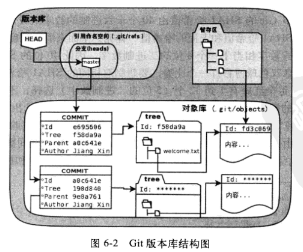
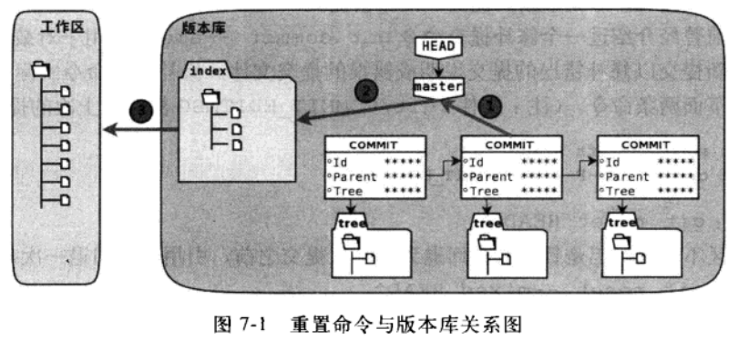
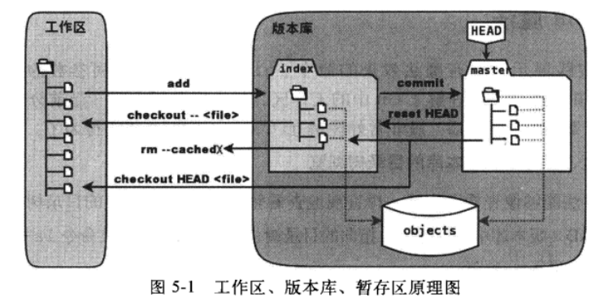
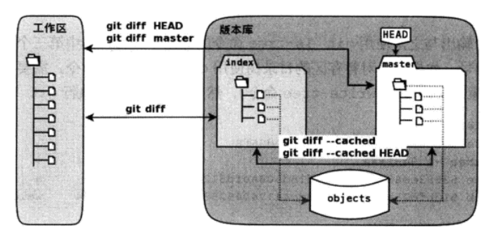

Git学习笔记
=========

Copyright © 2014-2016  xgfone(三界). All Rights Reserved.

## 前言

在`《Git权威指南》`中，作者蒋鑫将 `rebase` 翻译成“`变基`”，而在`《Pro Git》`中文版翻译团队将其翻译成“`衍合`”。本人感觉翻译成“`变基`”更形象，更符合其意，因此本文使用“`变基`”一词。而 `merge` 翻译成“`合并`”或“`归并`”。

本文中的部分图片来源于`《Git权威指南》`。

除非说明，下文中的 `$` 符号表示终端下的命令提示符。


## 基本知识

### 1、简介
`Git` --- The stupid content tracker，傻瓜内容跟踪器。

Git最初是由Linus为Linux内核开发的一个开源的分布式版本控制系统，以有效、高速地方式处理从很小到非常大的项目版本管理；现在很多开源项目的版本控制都纷纷迁移到了Git中。

### 2、安装
还是去Baidu或Google一下吧，这里就不介绍了。

### 3、对象
Git中有四种对象：`commit`、`tree`、`blob`、`tag`。

其中，可以把`tree`对象看作“`目录`”，把`blob`对象看成一个具体的文件（内容）；而`commit`和`tag`可以看成指向`tree`对象的一个软链接。

### 4、工作区间
Git在管理版本库时使用了三个工作区间：`工作区（working）`、`暂存区（staged）`、`版本库（repository）`。

`暂存区`位于`版本库`中，就是`版本库根目录下的 index 文件`。

`版本库`（一般来说）位于工作区中，就是工作区根目录中的 `.git` 目录。

对于`工作区`的判别，一般来说，可以认为`包含 .git 目录的目录就是工作区`（的根目录）；但有例外，比如：`裸版本库`。

`裸版本库`是没有工作区的版本库，即一个版本库不关联到一个工作区。 裸版本库一般用于Git版本库服务器，并且其名字以 `.git` 结尾。

版本库结构如下图：




## 基本使用

### 1、配置
在使用Git前，一般都会对Git做个简单配置，主要有两项：
```shell
$ git config --global user.name  “NAME”
$ git config --global user.email “NAME@EXAMPLE.COM”
```
注：`--global` 意思是针对当前系统的登录用户进行配置Git；此外还有 `--system` 选项，具体的配置请参见 `git help config`。

### 2、获取一个Git版本库
获取一个Git版本库有两种方式：
##### （1）克隆（clone）一个现有的版本库：
```shell
$ git clone https://github.com/torvalds/linux.git
```
此时会在当前目录下创建一个linux目录，此目录就是一个新的Git工作区；该目录下有一个.git目录，即 linux工作区的版本库。

##### （2）从当前目录初始化一个版本库：
```shell
$ mkdir linux && cd linux
$ git init
$ git add .
$ git commit -m “Initialized”
```
**注：**对于`git init`命令可以指定`--bare`选项，对于`git clone`命令可以指定`--bare`或`--mirror选项。--bare 选项表明创建一个裸版本库，即一个不带工作区的版本库；--mirror 选项同 --bare`选项（实际上，`--mirror` 选项隐式地提供了 `--bare` 选项），但相对于 `--bare` 选项，`--mirror` 选项不仅映射源版本库中的本地分支到目的版本库中的本地分支，还映射所有引用，并配置引用规范（refspec）选项。换一种说法：简单地说，相对于没有`--bare`或`--mirror`选项的命令，`--bare` 选项只创建一个不带工作区的裸版本库，而 `--mirror` 选项除了不带工作区，其他的都具备了。

### 3、新增、修改、删除或重命名一个文件
##### （1）新增或修改文件（add）
当新增一个文件可修改一个已经存在的文件后，为了让Git跟踪或记录它，需要使用 git add 命令将其添加到暂存区，语法如下：
```
$ git add filename
```
或者
```
$ git add .
```
表示将当前目录及其子目录下的所有没有跟踪（即新增）或记录（即修改）的文件放到暂存区中。

##### （2）删除文件（rm）
如果一个文件或目录不想要了，可以使用 `git rm [-r] [ FILES | DIRS ...]` 命令

##### （3）重命名文件（mv）
可以使用 `git  rm` 命令来重命名或移动一个文件或目录

注：`git rm` 和 `git mv` 两个命令和 UNIX SHELL中的 `rm`、`mv` 十分相似，可以像 `rm`、`mv` 一样来使用。

### 4、提交（commit）
当工作区的内容一旦发生改变，我们需要使用上一节的命令将变化的内容暂存到暂存区；为了将暂存区的内容保存起来，需要使用 git commit 命令将暂存区的内容保存到对象库中。基本语法：
```shell
$ git commit [-a] [-m “COMMINT DESCRIPTION”] [--allow-empty] [--amend]
```

（1）`-m` 选项指定提交说明，如果没有指定，git 将会打开一个编辑器让提交者输入提交说明。

（2）git 默认不允许提交空说明（即没有提交说明）；如果想要提交空说明，须要指定 `--allow-empty` 选项。

（3）`--amend` 选项表明重新提交上一次提交，即删除上一次提交对象，然后重新创建一个新的提交对象；此选项可以用于更改上一次提交的提交内容及提交说明。

注：**Git不能提交空目录**。

### 5、拉取（fetch）
如果我们的版本库是从远程版本库 `clone` 过来的，当远程版本库有更新时，我们可以通过 `git fetch` 命令将远程版本库中的最新内容拉取（或下载）到本地，并更新本地中的远程版本库分支指向。具体语法：
```
$ git fetch [<options>] [<repository> [<refspec>...]]
```

**选项：**
- `-p, --prune`：在拉取远程版本库的最新内容后，此选项会移除本地版本库存在而远程版本库却不存在的追踪分支(the remote-tracking branches)。
- `-t, --tags`：这是 `refs/tags/:refs/tags/` 的简化，此选项会获取所有远程版本库中的 tag，然后存在在本地。这是默认行为。
- `-n, --no-tags`：`-t, --tags` 的反动作。

**说明：**

（1）`<repository>` 和 `<refspec>` 语法及含义参见下文。

（2）`git fetch` 命令仅是把远程版本库的对象库中的最新对象拉取到本地，并没有进行合并。一般来说，我们还需要进行一次合并（或变基，关于变基，请参见 《git rebase 详解》）操作。

（3）`git fetch` 仅影响远程版本库分支，并不改变本地分支。

**注意：**

如果远程版本库中的某个 tag 已经被删除，当 fetch 时，本地对应的 tag 不会被删除，必须手工删除。一个解决办法就是：先删除所有本地的 tag，然后再执行 `git fetch -t` 即可。


### 6、合并（merge）
合并是将一个提交对象或其他分支（指向的提交对象）合并到当前分支（所指向的提交对象）上，合并一般会产生一个新的提交对象，并将当前分支指针指向该提交对象上。

但有一种例外，如果当前分支（所指向的提交对象）是将要合并的提交对象或其他分支（所指向的提交对象）的祖先时，并不会产生一个新的提交对象，Git仅是把当前分支的指针移动到那个提交对象或分支上。

有时，合并会产生冲突（conflict），此时Git会智能地主动去尝试解决冲突，如果冲突实在解决不了，合并就会中断，Git会列出冲突，并用户自行决断；当用户解决冲突后，再做一次提交即可（提交前不要忘了`git add` 一下）。

**常用语法：**
```shell
$ git merge [--no-commit] [-s <strategy>] [-X <strategy-option>] [-m <msg>] <commit>...
```
**说明：**

（1）默认地，`git merge` 命令在合并之后，提交合并后新产生的提交对象；如果不想在合并后自动提交，可以指定 `--no-commit` 选项。

（2）`git merge` 命令提供了多种合并策略，通过指定 `-s` 和 `-X` 选项，可以指定合并策略及其选项，以改变默认合并策略。

（3）如果没有指定 `--no-commit` 选项，可以指定 `-m` 选项，为自动提交指定一个提交说明。

（4）`<commit>` 是要合并的提交对象，即，将 `<commit>` 指向提交对象合并到当前分支中。

### 7、拉取并合并（pull）
如果须要从远程版本库拉取并合并更新，除了使用 `git fetch` 和 `git merge` 两个命令外，也可以 `git pull` 命令，此命令是 `git fetch` 和 `git merge` 的合集，即 `git pull` 首先执行 `git fetch` 命令，然后再执行 `git merge` 命令，可以把 `git pull` 命令看成是 `git fetch` 与 `git merge` 的合成版。注意：最终的合并是合并到当前的分支上。

**具体语法：**
```
$ git pull  [options]  [<repository> [<refspec>...]]
```
从远程版本库`拉取（fetch）`并`合并（merge）`更新到本地版本库。

**选项：**
（1）`--all`：获取所有远程分支提交对象。

（2）`--commit`：完成合并，并自动提交合并结果，即把合并结果提交为一个提交对象。这是默认行为。
（3）`--no-commit`：完成合并，但并不自动提交合并结果，而是假装合并失败，以便让用户在提交前检查、修改合并结果。
注：之后，用户须要手工提交合并结果。

（4）`-e`, `--edit`：完全合并，并自动提交合并结果，但在提交合并结果之前，自动打开一个编辑器，让用户修改自动产生的合并信息。

（5）`--no-edit`：主要用于接收、获取自动产生的合并信息。

（6）`--ff`：当合并是一个快速合并时（即当前分支的提交对象是要合并的提交对象的祖先），Git仅仅更新分支指向，并不产生一个新的合并提交对象。这是默认行为，一般不需要使用该选项。

（7）`--no-ff`：不管合并是否是一个快速合并，Git都创建一个新的合并提交对象。仅当合并一个带注解的Tag时，该选项才是默认行为。

（8）`--ff-only`：只有当HEAD是最新提交或者是一个快速合并时，Git按 `--ff` 选项处理；否则，Git 拒绝合并，并以出错行为退出。

（9）`-r`, `--rebase[=false|true|preserve]`：

    (A) 当为true时，git 在获取了远程版本库中最新的提交对象后，将当前分支变基rebase到远程分支的最新提交对象。
    (B) 如果为preserve，与true时相似，不同之处就是，在 rebase 时会把 --preserve-merge 选项传递给 git rebase 命令，
        也就是说，其行为相当于 git fetch 和 git rebase --preserve-merge 之和。
    (C) 如果为false，则将当前分支合并到远程分支中。

（10）`--no-rebase`：取消之前的 `--rebase` 选项，使 `git pull` 变成默认行为。

**注：**

`pull` 的默认行为（`git pull`）是 `git fetch` 和 `git merge` 的简写形式。

`git pull --rebase` 是 `git fetch` 和 `git rebase` 的简写形式。

当和别人合作开发时，如果要合并别人的最新提交，建议：永远使用变基提交，即添加 `--rebase` 选项。

#### 说明：

`<repository>`、`<refspec>`` 两个参数和 `git fetch` 命令中的格式和含义一样，但和`git push`命令中的相似，唯一不同的是：

    （1）在 git fetch 和 git pull 命令中：<src>表示远程版本库，<dst>表示本地版本库
    （2）在 git push 命令中：<src>表示本地版本库，<dst>表示远程版本库
    （3）如果指定了 <refspec> 或 一个分支名，get pull 并不会更新任何远程分支，即保留所有远程分支的指向不变。如：
          $ git pull origin master:foo
          $ git pull origin master
        否则，git pull 不仅会下载远程版本库中最新的提交并合并到本地版本库中的本地分支上，还会更新本地版本库中的远程分支指向。
    （4）git pull <===> git fetch + git merge：
        $ git pull origin foo  <==>  $ git fetch origin foo; git merge origin/foo
        $ git pull origin foo:bar  <==>  $ git fetch origin foo:bar; git merge bar
        因此，我们看到，最终的合并始终合并到当前分支上。

### 8、推送（push）
如果我们修改了版本库，即我们的本地版本库相对于远程版本库有了新的提交，为了把我们的更新反应到远程版本库中，可以使用 `git push` 命令将我们的本地版本库的更新推送到远程版本库中。

**具体语法：**
```
$ git push [--all | --mirror | --tags] [--follow-tags] [-f | --force] \
           [--prune]  [--no-verify] [-u] [<repository> [<refspec>...]]
```
更新（或推送）本地版本库中的分支内容到与其关联的远程版本库的分支，即将本地版本库的更新内容推送到远程版本库中。

**说明：**

    （1）如果省略 <repository>，则使用配置文件中与当前分支关联的 branch.*.remote 配置选项；
         如果没有配置 branch.*.remote 选项，则默认使用 origin。
    （2）如果省略 <refspec> 或 --all、--mirror、--tags 等选项，则使用配置文件中与当前分支关联的 remote.*.push 配置选项；
         如果没有配置 remote.*.push 选项，则使用 push.default 选项。
    （3）--all 选项：推送 refs/heads/ 目录下的每个引用。
    （4）--prune 选项：移除本地版本库不存在但远程版本库存在的分支；如果分支 foo 在本地版本库中并不存在，而存在于远程版本库中，
        此选项的结果将会删除远程版本库中的 foo 分支。
    （5）-u | --set-upstream 选项：对于每一个成功地up-to-date或pushed的分支，
        添加远程版本库的引用，即将远程版本库的某个分支和本地版本库的某个分支关联起来，下次使用时可以直接使用 git push 命令。
        此选项一般用于没有引用远程版本库分支的情况，如：远程版本库刚通过 git remote add 命令添加进来，
        还没有进行过任何推送，即该次推送是第一次推送。
    （5）<repository> 是远程版本库（即push的目的地），其值可以是一个URL或在配置文件中指定的远程版本库的名字
    （6）<refspec> 的格式是：  [+]<src>:<dst>
        <src>表示本地版本库（PUSH的源），其值是将要推送的本地分支名或任意的SHA1表达式；
        <dst>表示远程版本库（PUSH的目的地），其值必须分支名，不能是任何其它的表达式；
    （7）默认地，PUSH 命令只允许以下情况：
        A. <dst> 不是一个 tag（无论是否是带注释的）；
        B. PUSH 是一个快速（fast-forward）合并，即<src>所指向的提交对象和<dst>所指向的提交对象是父子关系。
           但是，通过在 <src> 前面添加 + 号（或者在git push 命令中指定 -f 选项），可以改变默认操作；
           但在此情况下，PUSH并不会试图将 <src> 合并到 <dst>。

#### 一个特殊应用：删除一个远程分支
在 `<refspec>` 中省略 `<src>`，直接使用  `[+]:<dst>`

省略了`<src>`（即本地分支名），相当于在说“从本地版本库中提取出空白，然后把变成（或替换掉）远程版本库中的`<dst>`分支”，把一个分支替换成空白，就如要把它删除一样。

#### 例子：
（1）将本地版本库的master分支推送到远程版本库origin：
```
$ git  push  [-u]  origin  master
```
注：将要被推送到远程版本库的分支按配置文件指定的或者是默认的。

（2）将本地版本库的master分支推送到远程版本库origin的develop分支：
```
$ git  push  origin  master:develop
```

（3）删除远程版本库origin的develop分支：
```
$ git  push  origin  :develop
```

注：`git push` 命令只能向一个裸版本库（即不带工作区的版本库）进行推送，不能向带工作区的版本库推送更新。

#### 远程仓库Tag管理：
说明：`push tag` 和 `push branch`没有任何区别。

（1）将本地Tag推送到远程仓库中：`$ git push origin tag_name`

（2）删除远程仓库中的Tag： `$ git push origin :tag_name`

（3）如果Tag名和Branch名一样时，Push须要指定表示Tag的refs的详细路径：`$ git push origin refs/tags/{TAG_NAME}`

（4）把所有的本地Tag都推送到远程仓库中：`$ git push origin --tags`

### 9、分支（branch 和 checkout）
##### branch 命令一般用于创建分支，常用语法：
```
（1）git branch [-r]
（2）git branch <branchname> [<start-point>]
（3）git branch (-m | -M) [<oldbranch>] <newbranch>
（4）git branch (-d | -D) [-r] <branchname>...
（5）git branch [--set-upstream | --track | --no-track] [-l] [-f] <branchname> [<start-point>]
    git branch (--set-upstream-to=<upstream> | -u <upstream>) [<branchname>]
```

**说明：**

第（1）种用法：列出本地版本库（或远程版本库，如果指定了-r选项）的分支。

第（2）种用法：基于`<start-point>`（如果省略，默认为`HEAD`），创建一个新的分支`<branchname>`。

第（3）种用法：将`<oldbranch>`重命名为`<newbranch>`；如果`<newbranch>`分支已经存在，需要使用参数 `-M` ，强制执行`git branch`重命名命令。

第（4）种用法：删除本地版本库（或远程版本库，如果指定了`-r`选项）的分支`<branchname>`。

第（5）种用法：设置或更新某个分支`<branchname>`所对应的远程分支。

#### checkout 命令一般用于分支的检出（即切换），常用语法：
```
（1）git checkout [<branch>]
（2）git checkout (-b | -B) <new_branch> [<start_point>]
（3）git checkout [<commit>] -- file...
```

**说明：**

第（1）种用法：检出分支`<branch>`，即把`<branch>`分支作为当前分支（即HEAD头指针的值）；如果省略`<branch>`，则会列出所有的分支名。

第（2）种用法：基于`<start_point>`（如果省略，默认为`HEAD`），创建一个新的分支`<new_branch>`，并检出分支`<new_branch>`；如果`<new_branch>`分支已经存在，需要使用参数 `-D` ，强制执行`git checkout`命令。

第（3）种用法：如果省略`<commit>`，则相当于从暂存区检出一个文件，即用暂存区中的文件 `file` 替换工作区中相应的文件；否则用指定的提交对象中的文件覆盖暂存区和工作区中对应的文件。`reset`命令一般用于重置暂存区（除非使用`--hard`选项，否则不重置工作区），而 `checkout` 命令主要是覆盖工作区（如果不省略`<commit>`，也会替换暂存区中相应的文件）。这种用法不会改变`HEAD`头指针，主要用于指定版本的文件覆盖工作区中对应的文件。这种用法的操作步骤如下图的`动作1`、`动作2`、`动作3`。


**注：**

（1）`git ckeckout`命令在检出一个分支时，Git会使用该分支的内容替换暂存区和工作区的内容。

（2）对于第（1）种用法，当检出一个分支时，不要直接使用提交对象，要使用分支名，否则`HEAD`头指针将处于分离状态（即指向图片一个提交对象，而不是一个分支），在某些情况下，可能会导致提交对象丢失。

（3）从远程分支`checkout`出来的本地分支，称为`跟踪分支（tracking branch）`。


### 10、标签（tag）
为了方便记忆，可以给某个提交对象打上一个标签；这在版本控制系统术语中，被称为“`里程碑`”。

**常用语法：**
```
（1）git tag [-a | -s | -u <key-id>] [-f] [-m <msg> | -F <file>] <tagname> [<commit> | <object>]
（2）git tag -d <tagname>...
（3）git tag [-n[<num>]] -l [<pattern>...]
（4）git tag -v <tagname>...
```

**说明：**

第（1）种用法： 在`<commit>`或`<object>`（如果省略，默认为`HEAD`）上，创建一个新的TAG标签`<tagname>`；如果`<tagname>`已经存在，需要使用 `-f` 参数；`-m` 选项为`<tagname>`标签提供一个说明信息；`-a` 选项表明`<tagname>`是一个无签名、但带注释的标签；`-s` 和 `-u` 选项为`<tagname>`提供一个GPG签名；`-F` 选项表明TAG信息从指定的文件中获取。

第（2）种用法：删除指定的`<tagname>`标签。

第（3）种用法：列出与`<pattern>`匹配的标签信息；如果省略，则默认列出所有的标签信息；`-n` 选项可以指定列出的标签的个数。

第（4）种用法：验证 `<tagname>`` 标签的GPG签名。

**标签对象**

如果有 `-a`, `-s` 或是 `-u` 中间的一个命令参数被指定，那么就会创建一个`标签对象`，并且需要一个`标签消息(tag message)`。如果没有 `-m` 或是 `-F` 这些参数，那么就会启动一个编辑器来让用户输入标签消息(tag message)。

当这样的一条命令执行后，一个新的对象被添加到Git对象库中，并且`标签引用`就指向了一个`标签对象`，而不是指向一个`提交(commit)`。这样做的好处就是：你可以为一个标签打上签名(sign)，方便你以后来查验这是不是一个正确的提交(commit)。

下面是一个创建标签对象的例子:
```
$ git tag -a stable-1 1b2e1d63ff
```

**_标签对象可以指向任何对象，但是在通常情况下是一个提交(commit)_**。

**其它：**

（1）远程仓库Tag管理，See “`推送Push`”！

（2）Tag只存储所指向的那次提交的 Hash 值，跟分支等没有关系。

### 11、提交日志（log）
`git log` 命令用来查看 `commit` 历史记录信息。

**常用语法：**
```
$ git log [-<num> | -n <num>] [-p | -u] [--oneline] [--graph] [ [--] <path>... ]
```

**说明：**

（1）`-<num>` 或 `-n <num>` 选项指定显示 `commit` 的个数。

（2）`--oneline` 选项以 `SVN` 的简短风格显示；如果不指定显示格式，`git log` 命令默认以 `--format=short` 格式显式。

（3）`-p` 或 `-u` 选项可以在每次`Commit`信息后显示其`Diff`内容。

（4）`--graph` 选项以文本型的图形表示法来展示提交历史。

（4）`<path>` 可以指定要打印日志信息的具体文件或目录，即只打印所指定的文件或目录的日志信息。

`git log` 命令的具体用法请参见 `git help log`。

### 12、提交历史比较（diff）
`git diff` 命令用于比较提交对象之间或提交对象与工作区之间的差异。见下文。

**常用语法：**
```
$ git diff [<commit>]
$ git diff --cache [<commit>]
$ git diff <commit> <commit>
```

### 13、提交状态（status）
`git status` 命令用于显示当前工作区的状态。

**常用语法：**
```
$ git status [-s | --short] [--long]
```

**说明：**

（1）`-s` 或 `--short` 选项指定以简短格式显式输出。

（2）`--long` 选项指定以长格式显式输出。

**注：**

简短格式的显式方式是： `XY PATH1  ->  PATH2`

    （1）第一列X的含义是：暂存区（stage）相对版本库中的文件的改动。
    （2）第二列Y的含义是：工作区当前的文件相对暂存区（stage）中改动。
    （3）X或Y的取值有：
        ‘ ‘ = unmodified
        M = modified
        A = added
        D = deleted
        R = renamed
        C = copied
        U = updated but unmerged
        具体情况请参见 git help status。

### 14、重置（reset）
`git reset` 命令可以用来（1）`重置工作区或暂存区中的内容`，（2）`重置当前分支的头`。

**常用语法：**
```
（1）git reset [<commit>] -- file...
（2）git reset [--soft | --mixed | --hard | --merge | --keep] [<commit>]
```

**说明：**

如果省略 `<commit>`，则默认使用 `HEAD` 指向的提交对象。

第（1）种用法：不会重置当前分支的引用，更不会改变工作区，而是用指定提交对象（`<commit>`）下的文件（`file...`）替换掉暂存区中的文件，相当于下图的`动作2`。

第（2）种用法：会重置当前分支（如master，而不是HEAD头指针）的引用。

    --soft：
        不重置暂存区和工作区中的内容，仅将当前分支的头重置（即移动）到<commit>提交对象，相当于执行下图中的 动作1。
    --mixed：
        只更改分支引用的指向及重置暂存区中的内容，而不重置工作区中的内容（默认选项），相当于执行下图中的 动作1 和 动作2。
    --hard：
        重置暂存区和工作区中的内容。相当于依次执行下图的
        动作1（替换引用的指向——引用指向新的提交对象）、
        动作2（替换暂存区；替换后，暂存区的内容和引用指向的目录树一致）、
        动作3（替换工作区；替换后，工作区的内容和暂存区一致，也和HEAD指向的目录树一致）。



**注：**`git reset [HEAD] filename` 命令相当于 `git add filename` 命令的反操作。

### 15、变基（rebase）
`git rebase` 的作用是将一个提交对象的基准由一个提交对象改变到另一个提交对象。

具体内容请参见另篇文章《[git rebase 详解](./git-rebase.md)》。

### 16、远程管理（remote）
`git remote` 命令主要用来管理被跟踪的远程版本库集。

**常用命令语法：**
```
（1）git remote [-v | --verbose]
（2）git remote add [-t <branch>] [-m <master>] [-f] [--tags | --no-tags] [--mirror=<fetch|push>] <name> <url>
（3）git remote rename <old> <new>
（4）git remote remove/rm <name>
（5）git remote [-v | --verbose] show [-n] <name>...
（6）git remote set-head <name> (-a | --auto | -d | --delete | <brance>)
（7）git remote set-branches [--push] <name> <newurl> [<oldurl>]
（8）git remote set-url [--push] <name> <newurl> [<oldurl>]
    git remote set-url --add [--push] <name> <newurl>
    git remote set-url --delete [--push] <name> <url>
（9）git remote prune [-n | --dry-run] <name>...
（10）git remote [-v | --verbose] update [-p | --prune] [(<group> | <remote>)...]
```

**说明：**

（1）列出存在的远程版本库。

（2）添加远程版本库`<url>`到本地版本库中，并在本地命名为`<name>`；此后，就可以通过“`git fetch <name>`”命令来创建或更新远程版本库中的分支`<name>/<branch>`。

    --tags 选项：执行“git fetch <name>”时，将导入远程版本库中的每个标签tag。
    --no-tags 选项：执行“git fetch <name>”时，不导入远程版本库中的任何标签。
    -t <branch> 选项：替换远程版本库中的默认glob引用规范，以便跟踪 refs/remotes/<name>/ 命令空间下的所有分支；
        此时，一个仅跟踪<branch>分支的引用将被创建。为了可以跟踪多个分支而不是捕获所有分支，可以指定多个 -t <branch> 选项。
    -m <master> 选项：如果指定该选项，将设置符号引用 refs/remotes/<name>/HEAD，使其指向远程的 <master> 分支。
    --mirror=<push|fetch> 选项：如果指定为 push，那么每次执行 git push 命令时，其行为就如同传递了 --mirror 选项。
        如果指定为 fetch，那么当 fetch 远程的更新时，获取的引用（refs）不会存储在 refs/remotes 命名空间中，
        而是直接将远程中 refs/ 目录下的所有文件和目录镜像到本地版本库中的 refs/ 下。
        这个选项仅在裸版本库（bare repositories）中才有意义，因为 fetch 将会覆盖本地的所有提交。

（3）将远程（版本库）的名字`<old>`修改为`<new>`；同时，所有与此远程相关的已跟踪的分支和配置也都会进行相应的更新。

注：此名字仅仅是本地版本库对远程版本库的引用、标记；对该名字进行修改，不会影响远程版本库的内容。

（4）移除名字`<name>`的远程版本库；同时，所有已跟踪的远程分支和配置也都会被移除。

注：该操作并不会删除远程服务器中的内容，它仅仅是解除本地版本库与远程版本库的关联，并将本地版本库中有关远程版本库的信息给删除。

（5）显示名为`<name>`的远程版本库的一些信息。

**备注：**
远程版本库的设置是由 `remote.origin.url` 和 `remote.origin.fetch` 两个配置变量管理的。

##### 例子：
添加一个远程版本库到本地版本库中：
```
$ git remote add torvalds https://github.com/torvalds/linux.git
```
然后就可以在本地版本版本库中通过 `torvalds` 这个名字来操作远程版本库 `https://github.com/torvalds/linux.git` 的信息（如：`branches`、`tags`）了。

### 17、管理Git操作历史（reflog）
`git reflog` 可用于查看当前版本库的操作日志，以便了解曾经执行过哪些命令；在日志中找出回溯历史之前的Hash值，可以通过 `git reset --hard` 命令恢复到回溯历史前的状态，这对找回被`HEAD`丢失的提交非常有用。

**常用语法：**
```
$ git reflog
```

**注意：**

一旦执行了 Git 的 GC，就有可能丢失先前的操作日志。


## 其它说明

### 1、工作区、暂存区和版本库之间的变化关系



当在工作区执行 `git add` 命令时（修改或新增文件），暂存区的目录树将被更新，同时工作区中修改或新增的文件的内容会被写入到对象库中一个新的对象中，而该对象的ID被记录在暂存区的文件索引中。

当执行提交操作（`git commit`）时，暂存区的目录树会被写入到版本库（对象库）中，`master`分支会做相应的更新，即`master`最新指向的目录树就是提交时原暂存区的目录树。

当执行 `git reset` 时，Git会使用版本库中最新提交（默认）的内容替换暂存区中的内容，即暂存区中的内容和版本库中最新提交的内容相同。如果使用 `--hard` 参数，除了替换暂存区的内容，同时也会替换工作区中的内容（即将工作区的状态替换成最新提交的状态）。

`git checkout` 命令和指定了 `--hard` 参数的 `git reset` 命令相似，除了 `git checkout` 命令可以检出一个或多个文件，或者整个提交历史状态。另外，`git checkout` 不仅可以用对象库中的提交对象替换暂存区或工作区中的内容，也可以用暂存区中的内容替换工作区中的内容；而`git reset` 只能使用对象库中的提交对象替换暂存区或工作区中的内容。

`git rm` 命令仅仅是将某个文件或目录从暂存区中删除，并不删除工作区中的文件或目录；另外，当使用 SHELL 命令 `rm` 将工作区中的文件或目录删除后，也须要使用 `git rm` 命令将该文件或目录从暂存区中删除。

文件`.git/index`实际上就是一个包含文件索引的目录树，像是一个虚拟的工作区。在这个虚拟工作区的目录树中，记录了文件名和文件的状态信息（时间戳和文件长度等）。文件的内容并没有存储在其中，而是保存在Git对象库`.git/objects`目录中，文件索引建立了文件和对象库中对象实体之间的对应。

### 2、工作区、暂存区、版本库之间的差异比较



    git diff 命令比较暂存区和工作区之间的差异；
    git diff  branch_name 命令比较版本库中 branch_name 分支的状态与工作区的状态之间的差异；
    git diff --cached [brance] 命令比较版本库中某个分支（默认是HEAD）的状态与暂存区的状态之间的差异。

当执行`git status`（或`git diff`）命令扫描工作区改动时，先依据`.git/index`文件中记录的（用于跟踪工作区文件的）时间戳、长度等信息判断工作区文件是否改变，如果工作区文件的时间戳改变了，说明文件的内容可能被改变了，需要打开文件、读取文件内容，与更改前的原始文件相比较，判断文件内容是否被更改。如果文件内容没有改变，则将该文件新的时间戳记录到`.git/index`中。

### 3、Git SHA1 哈希算法
Git版本库中的每个对象都用一个`SHA1哈希值`来表示，其算法是：
在对象（`commit`、`blob`、`tree`）的内容信息前添加字符串 ”`TYPE LENGTH<null>`”（即”`TYPE LENGTH<null>`”+`对象内容`，如：假设commit对象内容是”abcdefg”，则将执行SHA1算法的内容是”commit 7<null>abcdefg”），然后再执行`SHA1算法`。

### 4、文件忽略
Git提供了文件忽略功能。当对工作区某个目录或某些文件设置了忽略之后，再执行`git status`查看状态时，被忽略的文件即使存在也不会显示为未跟踪状态，甚至根本感觉不到这些文件的存在。

#### Git文件忽略有两种类型：共享式  和 本地独享式。
共享式忽略文件会成为版本库的一部分，当版本库共享给其他人（如克隆）时，或者把版本库推送（Push）到集中式的服务器（或他人的版本库）时，这个忽略文件就会出现在他人的版本库及工作区中，文件忽略在他人的工作区中同样生效。而本地独享式忽略文件不会成为版本库的一部分，也就不会被他人所获取，因此也就不会影响到他人的工作区。

##### （1）共享式忽略
共享式忽略使用 `.girignore` 文件

    A. 文件.gitignore可以放在任何目录中。
    B. 文件.gitignore的作用范围是其所处的目录及其子目录。
    C. 忽略只对未跟踪文件有效，对于已加入版本库的文件无效。

##### （2）独享式忽略
独享式忽略有两种方式：

    A. 一种是针对具体版本库的“独享式”忽略，即在版本库.git目录下的一个文件 .git/info/exclude 来设置文件忽略。
    B. 一种是全局的“独享式”忽略，即通过Git的配置变量 core.excludesfile 指定的一个忽略文件，其设置的忽略对所有本地版本库均有效。

#### 文件忽略语法

    （1）忽略文件中的空行或以井号（#）开始的行会被忽略。
    （2）可以使用通配符，参见Linux手册：glob(7)。所谓的 glob 模式是指 shell 所使用的简化了的正则表达式。
        如：星号（*）代表任意多字符，问号（?）代表一个字符，方括号（[abc]）代表可选字符范围等等。
    （3）如果名称的最前面是一个路径分隔符（/），表明要忽略的文件在此目录下，而非子目录的文件。
    （4）如果名称的最后面是一个路径分隔符（/），表明要忽略的是整个目录，同名文件不忽略，否则同名文件和目录都被忽略。
    （5）通过在名称的最前面添加一个感叹号（!），代表不忽略。

### 5、如何检出 Tag 标签
默认地，**Git 不能 checkout 一个 Tag 标签**， `git checkout` 必须是一个 `branch 分支`。因此，如果没有对应于 Tag 的一个 Branch，可以先基于 Tag 标签创建一个 Branch，然后再 checkout 该分支即可。涉及到的命令如下：
```
$ git brance   branch_tag_name tag_name
$ git checkout branch_tag_name
```

**注：**

（1）以上两个命令可以合成一个命令：`$ git checkout -b branch_tag_name tag_name`

（2）`branch_tag_name` 最好和 `tag_name` 一致。

### 6、克隆远程的所有分支
新的 Git 版本默认克隆远程所有的分支，但除了 `master` 分支，其他的分支是隐藏的，即在本地仓库中已经有了远程版本库中的所有分支，但没有对应的本地版本库中的分支。

分支是与版本库关联的，即一个版本库有分支 A，并不代表另一个克隆的版本库也有分支 A。本地版本库的某个分支要想与远程版本库的某个分支建立联系，需要在本地版本库中建立一个与远程版本库某个分支关联的分支。

涉及到命令如下（以openstack中的cinder为例）：

##### （1）列出本地分支：
```
$  git branch
* master
```

##### （2）列出本地版本库和远程版本库中的所有分支）：
```
$  git branch  -a
* master
  remotes/origin/HEAD -> origin/master
  remotes/origin/master
  remotes/origin/stable/havana
  remotes/origin/stable/icehouse
```

##### （3） 与远程版本库中的 remotes/origin/stable/havana 分支建立关联：
```
$ git checkout -b stable/havana remotes/origin/stable/havana
```

##### （4）再次查找本地版本库中的分支信息：
```
$  git  branch
  master
* stable/havana
```
注：此时已经在本地版本库中建立了一个基于 `remotes/origin/stable/havana` 远程分支的新分支 `stable/havana`，并切换到该分支中。
