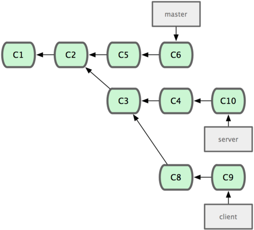
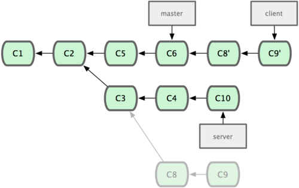
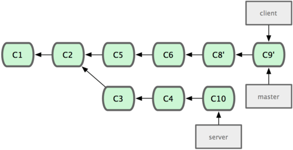

Git rebase 详解
==============

Copyright © 2014-2016  xgfone(三界). All Rights Reserved.

## 前言

在`《Git权威指南》`中，作者蒋鑫将 `rebase` 翻译成“`变基`”，而在`《Pro Git》`中文版翻译团队将其翻译成“`衍合`”。本人感觉翻译成“`变基`”更形象，更符合其意，因此本文使用“`变基`”一词。

看了蒋鑫写的`《Git权威指南》`中有关 `rebase` 变基的章节，虽说作者带着例子一步步讲解（遗憾的是好像没有图表说明，图表比文字更有说服力），感觉云里雾里的，不知所云；看了`《Pro Git》`对 `rebase` 的讲解（感觉还是外国人写的精辟，寥寥数语就把问题讲明白了），结果恍然大悟、茅塞顿开，犹如醍醐灌顶一般。

本文中的图片来源于`《Pro Git》`一书；另外，`变基原理`及后续章节参考了`《Pro Git》（中文版）第三章中的 3.6 小节`。

*图片中带箭头一侧是父提交对象或父分支，不带箭头一侧是子提交对象或子分支。*


## 语法
```
$ git rebase [-i] base-branch [branch]
$ git rebase [-i] --onto new-base-branch old-base-branch [branch]
```
`git rebase` 的使用主要有上面两种，合成一个就是 `git rebase [--onto new-base-branch] base-branch branch`。

`[branch]` 可以省略。如果省略，则默认为当前分支，即 `HEAD 所指的分支`（也可以认为是 `HEAD`）。

#### 选项
（1）`-i` 选项表示执行交互式rebase，此时会打开一个将要被rebase的提交对象列表，让用户来进行交互式操作。

注：在 `git rebase` 的官方文档中将 `base-branch` 和 `old-base-branch` 写成 `upstream`、`new-base-branch` 写成 `newbase`。笔者之所以在写成 `base-branch`、`old-base-branch`、`new-base-branch`，因为这三个名字更容易说明其所代表的含义。


## 语法解释

### 1、第一种用法的含义

    将分支 branch 的基准变成 base-branch 分支，换句话说就是，将 base-branch 分支变成（或成为）branch 分支的祖先分支
    （如果 branch 和 base-branch 拥有同一个父分支，那么变基之后，base-branch 就是 branch 的父分支）。

#### 例子
##### （1）背景
`master` 分支和 `experiment` 分支拥有同一个祖先（同时也是一个父分支），如下图：


##### （2）执行变基操作
具体命令：`git rebase master experiment`。其中 `experiment` 可以省略不写，但此时的当前分支必须是 `experiment`。

执行变基后，`master` 分支将变成 `experiment` 分支的基准分支（也即是祖先分支），如下图：


注意：其中的 `C3` 提交点是灰色的，表明已经不存在了；而是变成了 `C3'` 提交点，而且 `C4` 提交点（即 `master` 分支）成为了 `C3'` 提交点的祖先分支（同时也是父分支），即通过以 `C4` 为基准重新更换 `experiment` 的历史提交点，让 `master` 分支成为 `experiment` 分支的祖先分支。**通过变基，我们会发现，提交点由原先的两条路径变成了一条路径**_。

##### （3）合并（可选）
当前 `master` 已经是 `experiment` 的祖先分支（同时也是父分支）了，可以执行（快速）合并操作，将 `master` 分支指针移动到 `experiment` 上（即 `C3'` 提交点）。具体操作：

    A. 如果当前分支不是 master，须要先切换到 master 分支：$ git checkout master
    B. 执行（快速）合并操作：$ git merge experiment

注：在此例中，之所以称为快速合并，是因为 `master` 是 `experiment` 的父分支（它们所指向的提交点是相邻的）。

### 2、第二种用法的含义

    将 branch 分支的直接祖先分支 old-base-branch 更换成 new-base-branch 分支。
    即执行变基前，old-base-branch 分支是 branch 分支的直接祖先分支；
    执行变基后，old-base-branch 不再是 branch 的直接祖先分支，而 new-base-branch 成为了 branch 的直接祖先分支。

注：使用第二种用法有一个前提 —— `old-base-branch` 须要是 `branch` 的直接祖先分支。

#### 例子：
##### （1）背景
`client` 分支已经有个直接祖先分支 `server` 了，通过第二种变基操作，可以将 `client` 的直接祖先变成 `master`。注： `master` 可以是 `client` 的祖先分支，但不是直接祖先分支。如下图：



##### （2）执行变基操作
具体命令：`git rebase --onto master server client`。结果如下图：



##### （3）合并 client（可选）
可以执行合并操作（此时不是快速合并），将 `master` 指向 `C9'` 提交点。
具体操作：

    A. 如果当前分支不是 master，须要先切换到 master 分支：$ git checkout master
    B. 执行合并操作：$ git merge client

结果如下图：



注：此时的情况与第一种用法中的例子相似。

##### （4）对 server 执行变基（可选）
此时如果也想要把 `server` 分支变基到 `master`，只须要使用第一种用法即可：`git rebase master server`。
结果如下图：


##### （5）合并 server（可选）
最后执行合并操作，将 `master` 指针指向 `C10'` 提交点。
具体操作：

    A. 如果当前分支不是 master，须要先切换到 master 分支：$ git checkout master
    B. 执行合并操作：$ git merge server

##### （6）删除分支（可选）
此时，`client` 和 `server` 两个分支已经没有用处了（它们都已经合并到 `master` 分支上了），因此可以删除了：
```
$ git  branch  -d  client
$ git  branch  -d  server
```
最终结果如下图：


### 特殊应用
初始化情景如下图：


执行第二种变基用法：`git rebase --onto C2 C9' master`。

##### 结果
（由于不方便画图，就简单地说明一下，应该能够看得懂）： `C5`、`C6`、`C8'`、`C9'` 等四个提交对象将消失，而 `C3'`、`C4'`、`C10'` 等三个提交对象将以 `C2` 为基准重新生成 `C3''`、`C4''`、`C10''` 三个对象；最终的路径从左到右依次是：`C1`、`C2`、`C3''`、`C4''`、`C10''`，而 `master` 指向 `C10''` 提交对象。

##### 结果解释
上述的 `C5`、`C6`、`C8'`、`C9'` 四个提交对象并不是直接删除了，而是将其相对于 `C2` 基准的改变（即补丁文件）合并到了 `C3'`、`C4'`、`C10'` 三个提交对象中；因此，`C3'`、`C4'`、`C10'` 三个提交对象势必要发生变化，所以它们三个须要重新生成，即是 `C3''`、`C4''`、`C10''`。

##### 应用目的
可以用来压缩提交对象。


## 变基原理
以第一种情况为例子进行说明：

回到两个分支最近的共同祖先（即`C2`），根据当前分支（也就是要进行变基的分支 `experiment`）后续的历次提交对象（这里只有一个 `C3`），生成一系列文件补丁，然后以基底分支（也就是主干分支 `master`）最后一个提交对象（即`C4`）为新的出发点，逐个应用之前准备好的补丁文件，最后会生成一个新的合并提交对象（`C3'`），从而改写 `experiment` 的提交历史，使它成为 `master` 分支的（直接）下游。

注：如果 `experiment` 分支在 `C2` 提交对象之后有多个提交对象（比如：除了`C3`，还有`C5`、`C6`等），那么会根据相应的补丁文件生成相应的、新的提交对象（如：`C3'`、`C5'`、`C6'`等）；`experiment` 分支在 `C2` 提交对象之后有几个提交对象，就会生成几个新的提交对象（与其对应）。

用一句话总结就是：_**在进行衍合的时候，实际上抛弃了一些现存的提交对象而创造了一些类似但不同的新的提交对象**_。


## 使用变基的目的
一般我们使用衍合的目的，是 _**想要得到一个能在远程分支上干净应用的补丁**_ — 比如某些项目你不是维护者，但想帮点忙的话，最好用变基：_**先在自己的一个分支里进行开发，当准备向主项目提交补丁的时候，根据最新的 `origin/master` 进行一次衍合操作然后再提交，这样维护者就不需要做任何整合工作**_（注：实际上是把解决分支补丁同最新主干代码之间冲突的责任，化转为由提交补丁的人来解决。），_**只需根据你提供的仓库地址作一次快进合并，或者直接采纳你提交的补丁**_。


## 变基（rebase）与合并（merge）的异同

    （1）合并结果中最后一次提交所指向的快照，无论是通过变基，还是三方合并，都会得到相同的快照内容，只不过提交历史不同罢了。
        变基是按照每行的修改次序重演一遍修改，而合并是把最终结果合在一起。
    （2）变基和合并的结果都是将多条路径变成一条路径，但合并的结果（一条路径）在某个点却分路
       （可以理解为：一个提交对象有多个父提交对象），而变基的结果始终是一条路径，不会有分路（即每个提交对象都只有一个父提交对象）。


## 变基准则
不是任何情况下都可以使用变基的：在某些情况，一旦使用变基，就有可能让提交历史变得一团糟。

因此，变基有一条金科玉律：_**一旦分支中的提交对象发布到公共仓库，就千万不要对该分支进行变基（rebase）操作**_。

如果你遵循这条金科玉律，就不会出差错。否则，人民群众会仇恨你，你的朋友和家人也会嘲笑你，唾弃你。

### 原因
由于在进行衍合的时候，实际上抛弃了一些现存的提交对象而创造了一些类似但不同的新的提交对象。如果你把原来分支中的提交对象发布出去，并且其他人更新下载后在其基础上开展工作，而稍后你又用 `git rebase` 抛弃这些提交对象，把新的重演后的提交对象发布出去的话，你的合作者就不得不重新合并他们的工作，这样当你再次从他们那里获取内容时，提交历史就会变得一团糟。

一个很好的例子：[中文版](http://git-scm.com/book/zh/Git-%E5%88%86%E6%94%AF-%E5%88%86%E6%94%AF%E7%9A%84%E8%A1%8D%E5%90%88#%D1%DC%BA%CF%B5%C4%B7%E7%CF%D5) 和 [英文版](http://git-scm.com/book/en/v2/Git-Branching-Rebasing#The-Perils-of-Rebasing)。
