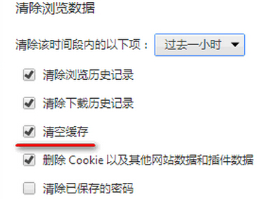

## 浏览器 HTTP 协议缓存机制详解

### 1、缓存的分类

缓存分为`服务端侧`（server side，比如 Nginx、Apache）和`客户端侧`（client side，比如 web browser）。

服务端缓存又分为 `代理服务器缓存` 和 `反向代理服务器缓存`（也叫`网关缓存`，比如 Nginx反向代理、Squid等），其实广泛使用的 CDN 也是一种服务端缓存，目的都是让用户的请求走”捷径“，并且都是缓存图片、文件等静态资源。

客户端侧缓存一般指的是浏览器缓存，目的就是加速各种静态资源的访问，想想现在的大型网站，随便一个页面都是一两百个请求，每天 pv 都是亿级别，如果没有缓存，用户体验会急剧下降、同时服务器压力和网络带宽都面临严重的考验。



### 2、浏览器缓存机制详解

浏览器缓存控制机制有两种：`HTML Meta标签` vs. `HTTP头信息`

#### 2.1 HTML Meta 标签控制缓存

浏览器缓存机制，其实主要就是 HTTP 协议定义的缓存机制（如：`Expires`、`Cache-control` 等）。但是也有非 HTTP 协议定义的缓存机制，如使用 HTML Meta 标签，Web 开发者可以在 HTML 页面的 `<head>` 节点中加入 `<meta>` 标签，代码如下：
```html
<META HTTP-EQUIV="Pragma" CONTENT="no-cache">
```

上述代码的作用是告诉浏览器当前页面不被缓存，每次访问都需要去服务器拉取。使用上很简单，但只有部分浏览器可以支持，而且所有缓存代理服务器都不支持，因为代理不解析 HTML 内容本身。而广泛应用的还是 HTTP 头信息 来控制缓存，下面我主要介绍 HTTP 协议定义的缓存机制。

#### 2.2 HTTP头信息控制缓存

##### 2.2.1 浏览器请求流程

浏览器第一次请求流程图：


浏览器再次请求时：


##### 2.2.2 几个重要概念解释

1. **`Expires`策略**

`Expires` 是 Web 服务器响应消息头字段，在响应 http 请求时告诉浏览器在过期时间前浏览器可以直接从浏览器缓存取数据，而无需再次请求。不过 `Expires` 是 HTTP 1.0 的东西，现在默认浏览器均默认使用 HTTP 1.1，所以它的作用基本忽略。`Expires` 的一个缺点就是，返回的到期时间是服务器端的时间，这样存在一个问题，如果客户端的时间与服务器的时间相差很大（比如时钟不同步，或者跨时区），那么误差就很大，所以在 HTTP 1.1 版开始，使用 `Cache-Control: max-age=秒` 替代。

2. **`Cache-control`策略（重点关注）**

`Cache-Control` 与 `Expires` 的作用一致，都是指明当前资源的有效期，控制浏览器是否直接从浏览器缓存取数据还是重新发请求到服务器取数据。只不过 `Cache-Control` 的选择更多，设置更细致，如果同时设置的话，其优先级高于 `Expires`。

值可以是 `public`、`private`、`no-cache`、`no- store`、`no-transform`、`must-revalidate`、`proxy-revalidat`e、`max-age`。各个消息中的指令含义如下：
```
Public    指示响应可被任何缓存区缓存。
Private   指示对于单个用户的整个或部分响应消息，不能被共享缓存处理。
          这允许服务器仅仅描述当用户的部分响应消息，此响应消息对于其他用户的请求无效。
no-cache  指示请求或响应消息不能缓存，该选项并不是说可以设置”不缓存“，容易望文生义~
no-store  用于防止重要的信息被无意的发布。在请求消息中发送将使得请求和响应消息都不使用缓存，完全不存下來。
max-age   指示客户机可以接收生存期不大于指定时间（以秒为单位）的响应。
min-fresh 指示客户机可以接收响应时间小于当前时间加上指定时间的响应。
max-stale 指示客户机可以接收超出超时期间的响应消息。
          如果指定max-stale消息的值，那么客户机可以接收超出超时期指定值之内的响应消息。
```

3. **`Last-Modified`/`If-Modified-Since`**

`Last-Modified/If-Modified-Since` 要配合 `Cache-Control` 使用。

```
Last-Modified      标示这个响应资源的最后修改时间。web 服务器在响应请求时，告诉浏览器资源的最后修改时间。
If-Modified-Since  当资源过期时（使用Cache-Control标识的max-age），发现资源具有 Last-Modified 声明，
                   则再次向web服务器请求时带上头 If-Modified-Since，表示请求时间。
                   web服务器收到请求后发现有头 If-Modified-Since 则与被请求资源的最后修改时间进行比对。
                   若最后修改时间较新，说明资源又被改动过，则响应整片资源内容（写在响应消息包体内），HTTP 200；
                   若最后修改时间较旧，说明资源无新修改，则响应 HTTP 304 (无需包体，节省浏览)，
                   告知浏览器继续使用所保存的cache。
```

4. **`Etag/If-None-Match`**

`Etag`/`If-None-Match` 也要配合 `Cache-Control` 使用。

```
Etag           web服务器响应请求时，告诉浏览器当前资源在服务器的唯一标识（生成规则由服务器决定）。Apache中，ETag的值，
               默认是对文件的索引节（INode），大小（Size）和最后修改时间（MTime）进行Hash后得到的。

If-None-Match  当资源过期时（使用Cache-Control标识的max-age），发现资源具有 Etage 声明，则再次向 web 服务器请求时
               带上头If-None-Match （Etag的值）。web服务器收到请求后发现有头If-None-Match 则与被请求资源的相应
               校验串进行比对，决定返回 200 或 304。
```

5. 既生 `Last-Modified` 何生 `Etag`？

你可能会觉得使用 `Last-Modified` 已经足以让浏览器知道本地的缓存副本是否足够新，为什么还需要 `Etag`（实体标识）呢？HTTP1.1中 `Etag` 的出现主要是为了解决几个 `Last-Modified` 比较难解决的问题：
```
Last-Modified 标注的最后修改只能精确到秒级，如果某些文件在 1 秒钟以内被修改多次的话，它将不能准确标注文件的修改时间。
如果某些文件会被定期生成，当有时内容并没有任何变化，但 Last-Modified 却改变了，导致文件没法使用缓存。
有可能存在服务器没有准确获取文件修改时间，或者与代理服务器时间不一致等情形。

Etag 是服务器自动生成或者由开发者生成的对应资源在服务器端的唯一标识符，能够更加准确的控制缓存。
Last-Modified 与 ETag 一起使用时，服务器会优先验证 ETag。
```

6. yahoo 的 Yslow 法则中则提示谨慎设置 `Etag`

需要注意的是分布式系统里多台机器间文件的 `last-modified` 必须保持一致，以免负载均衡到不同机器导致比对失败，Yahoo建议分布式系统尽量关闭掉 `Etag`(每台机器生成的 `etag` 都会不一样，因为除了 `last-modified`、`inode` 也很难保持一致)。

7. `Pragma` 行是为了兼容 HTTP1.0，作用与 `Cache-Control`、`no-cache` 是一样的。

**最后总结下几种状态码的区别：**


### 3、用户行为与缓存

浏览器缓存行为还有用户的行为有关，如果大家对 `强制刷新(Ctrl + F5)` 还有印象的话应该能立刻明白我的意思~

用户操作     | Expires/Cache-Control | Last-Modified/Etag
-------------|-----------------------|-----------------------
地址栏回车   |          有效         |        有效
页面链接跳转 |          有效         |        有效
新开窗口     |          有效         |        有效
前进、后退   |          有效         |        有效
F5/按钮刷新  | 无效(BR重置max-age=0) |        有效
Ctrl+F5刷新  | 无效(重置CC=no-cache) | 无效(请求头丢弃该选项)

具体请参考文末 Refer [6]

4、Refer：

- [1. 浏览器缓存机制](http://www.cnblogs.com/skynet/archive/2012/11/28/2792503.html)
- [2. Web 开发人员需知的 Web 缓存知识](http://www.oschina.net/news/41397/web-cache-knowledge)
- [3. 浏览器缓存详解:expires,cache-control,last-modified,etag详细说明](http://blog.csdn.net/eroswang/article/details/8302191)
- [4. 在浏览器地址栏按回车、F5、Ctrl+F5刷新网页的区别](http://blog.csdn.net/yui/article/details/6584401)
- [5. Cache Control 與 ETag](https://blog.othree.net/log/2012/12/22/cache-control-and-etag/)
- [6. 缓存的故事](http://segmentfault.com/blog/animabear/1190000000375344)
- [7. Google的PageSpeed网站优化理论中提到使用Etag可以减少服务器负担](https://developers.google.com/speed/docs/pss/AddEtags)
- [8. yahoo的Yslow法则中则提示谨慎设置Etag](http://developer.yahoo.com/performance/rules.html#etags)
- [9. H5 缓存机制浅析 移动端 Web 加载性能优化](http://segmentfault.com/a/1190000004132566)
- [10. 网页性能： 缓存效率实践](http://www.w3ctech.com/topic/1648)
- [11. 透过浏览器看HTTP缓存](http://www.cnblogs.com/skylar/p/browser-http-caching.html)
- [12. 浏览器缓存知识小结及应用](http://web.jobbole.com/84888/)
- [13. 大公司里怎样开发和部署前端代码？](http://zhihu.com/question/20790576/answer/32602154?utm_campaign=webshare&utm_source=weibo&utm_medium=zhihu)
- [14. 浏览器缓存机制详解](https://mangguo.org/browser-cache-mechanism-detailed/)

------

From: https://my.oschina.net/leejun2005/blog/369148
